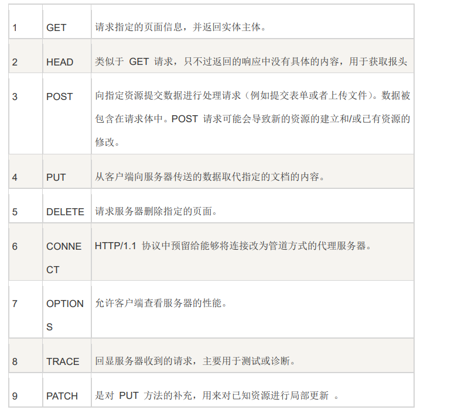

### http（一请求一响应，适合做短连接）

[http服务器的实现.pdf](file:///D:/零声Linux/网络/http/http服务器的实现.pdf)

1.建立tcp连接

2.在tcp连接，socket的基础上，发送http协议请求

3.服务器在tcp连接socket，返回http协议响应response

---

流程：

1.www.baidu.com -->翻译成ip地址  （DNS）

2.tcp连接这个ip地址，端口

3.发送http协议

4.接收http协议

客户端：

1.创建socket

2.初始化sockaddr

3.connect

4.准备请求报文



5.send请求

6.recv接收

### 回应报文

报文头：

```c++
Http/1.1 200 OK
Date: Thu, 11 Nov 2021 12:28:52 GMT //星期逗号空格日空格月空格年空格时间
Content-Encoding: gzip//对body进行压缩的方式,即该段表示对body的打包格式
Content-Type: text/html;charset=utf-8//body的类型即编码格式
Content-Length: 122//body的长度//一定要严格
```

### 如果遇到浏览器转圈的情况，是服务器还未将数据发完

### 各种请求：

(1)GET:向服务器请求数据

(2)POST:向服务器传递数据

### 常见的Content-Type：

[(65条消息) 各浏览器对常用或者错误的 Content-Type 类型处理方式不一致_???Sir的博客-CSDN博客](https://blog.csdn.net/weixin_34268169/article/details/86256772)

text/plain

text/[html](http://www.itjxue.com/plus/search.php?kwtype=0&keyword=html&)

text/css

image/jpeg

image/png

image/svg+xml

image/avif

image/webp

image/apng

audio/mp4

video/mp4

application/javascript

application/pdf

application/zip

application/atom+xml

application/xhtml+xml

application/xml

### 请求分类：

https://blog.csdn.net/csucsgoat/article/details/123081471