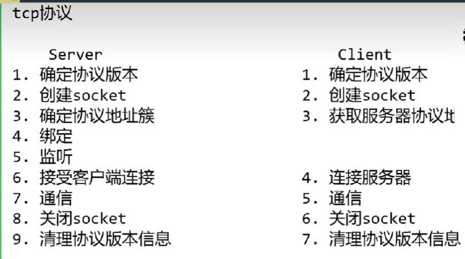
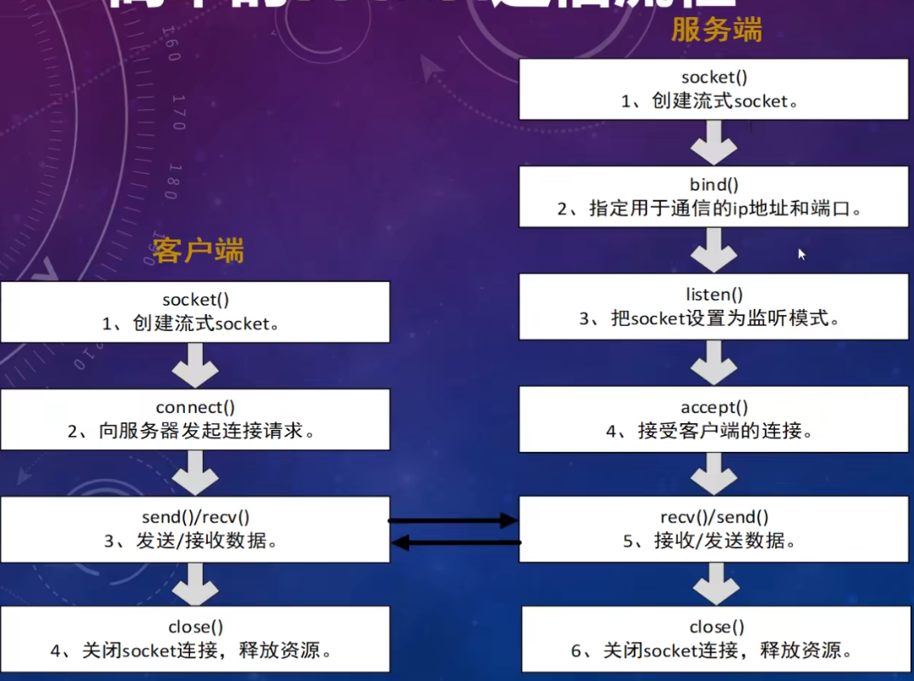
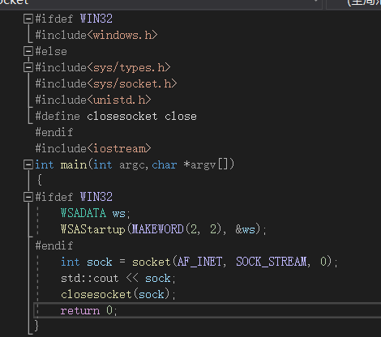

# Socket

 简单的socket通信流程模型





跨平台模板：



## 头文件

linux下网络编程常用头文件：sys/socket.h   ,   netinet/in.h   ,   arpa/inet.h    ,     fcntl.h//设置非阻塞io的头文件    ，	netdb.h/gethostbyname()函数   sys/epoll.h /epoll  gethostbyname在netdb.h

SOCK_STREAM : 流形式发送(Tcp常用)

SOCK_DGRAM : 数据报形式发送（UDP常用  ）

**错误提示：windows.h中包含winsock.h 这时使用winsock2.h会报错**

char*   inet_ntoa(in_addr   addr)//将in_addr(32位int型)转换为char*

in_addr  inet_addr(const char* ip)//将const char*转换为in_addr 

---

如果socket是阻塞，程序会等待返回，read，线程会被挂起

如果socket是非阻塞，程序read时，没有数据也是立马返回，线程不会被挂起

（一般服务器开发中都设置为非阻塞）

### 常用命令

netstat  -anop|grep 端口号   可以查看端口还有多少秒退出占用

## select(io多路复用)

[(69条消息) Linux中对文件描述符的操作（FD_ZERO、FD_SET、FD_CLR、FD_ISSET）_houxiaoni01的博客-CSDN博客](https://blog.csdn.net/houxiaoni01/article/details/103316774)

使用fcntl(sock   socket,F_SETFL,O_NONBLOCK);

select 检测网络io( recv )里面有没有可读的数据

select(maxfd+1,&rset,&wset,&eset,timeval* tv) 

[select函数](https://baike.baidu.com/item/select函数/10792714?fromModule=lemma_inlink)成功返回时会将未准备好的描述符位清零

​	fd_set就是比特位的设置

​	五个参数分别： 1.fd_set的长度  2.关注哪些fd_set集合收到数据（recv）  3.关注哪些fd_set集合能写（send） 4.关注哪些fd_set 集合有错误  5.多长时间select轮询一次io

流程：

```c++
fd_set  fdread;//一个io的数组，如果有数据来对应io下标（即socket）的数组就置1，无数据则置0
FD_ZERO(&fdread);//置空
FD_SET(sockfd,&fdread);//将fdread的对应比特位置为1
timeval tv;
tv.tv_sec=5;//5s
tv.tv_usec=0;
while(1)
{
	int selection=select(socked+1,&fread,NULL,NULL,&tv);//返回多少个io 
	if(!selection||!FD_ISSET(sockfd,&fdread))//判断io是否为零或者sockfd是否存在于fdread(即对应fd_set是否被置为1)
	{
		break;
	}else
	{
		memset(buffer,0,BUFFERSIZE);
		int len=recv(sockfd,buffer,BUFFERSIZE,0);//可能出现一次recv无法接收全部包,因此需要定义一个变量接收全部的recv
	}
}
```

```c++
#include<iostream>
#include<list>
#include<memory>
#if defined(__linux__)
#include<unistd.h>
#include<sys/socket.h>
#include<arpa/inet.h>
#define closesocket close
#else
#include<WinSock2.h>
#define socklen_t int
#endif
#include<functional>
using namespace std;
#pragma comment(lib,"ws2_32.lib")
int main()
{
#if defined(__WIN32)
    WSADATA ws;
    WSAStartup(MAKEWORD(2, 2), &ws);
#endif
    int sockfd = socket(AF_INET, SOCK_STREAM, 0);
    sockaddr_in sin;
    sin.sin_family = AF_INET;
    sin.sin_addr.s_addr = htonl(INADDR_ANY);
    sin.sin_port = htons(9999);
    int ret = ::bind(sockfd, (sockaddr*)&sin, sizeof(sin));
    if ( ret == -1)
    {
        cout << "绑定失败" << endl;
    }
    listen(sockfd, 10);
    fd_set rfd,wfd,rset,wset;
    FD_ZERO(&rfd);
    FD_SET(sockfd, &rfd);
    FD_ZERO(&wfd);
    FD_SET(sockfd, &wfd);
    int maxfd = sockfd;
    char buf[1024] = { 0 };
    int len = 0;
    while (1)
    {
        rset = rfd;
        wset = wfd;
        int nready = select(maxfd + 1, &rset, &wset, NULL, NULL);
#if 1
        if (FD_ISSET(sockfd, &rset))
        {
            sockaddr_in clsin;
            socklen_t len=sizeof(clsin);
            int clientfd = accept(sockfd, (sockaddr*)&clsin,&len );
            if (clientfd != -1)cout << "连接成功" << endl;
            FD_SET(clientfd, &rfd);
            maxfd = max(maxfd, clientfd);
            send(clientfd, "yes", 4, 0);
        }
        for (int i = sockfd + 1; i <= maxfd; i++)
        {
            if (FD_ISSET(i, &rset)) {
                len = recv(i, buf, sizeof(buf), 0);
                if (len == 0) {
                    closesocket(i);
                    FD_CLR(i, &rfd);
                }
                else if (len > 0)
                {
                    cout << buf << endl;
                    FD_SET(i, &wfd);
                }
            }
            else if (FD_ISSET(i, &wset)) {
                send(i, buf, len, 0);
                //FD_SET(i, &rfd);
                FD_CLR(i, &wfd);
            }
        }
#endif // 0
        
    }
    return 0;
}

```


**设置阻塞头文件  fcntl.h**

**Linux设置非阻塞fcntl(socket,F_SETFL,O_NONBLOCK)**

**windows设置非阻塞**

```c++
int flag = 1;//flag为0阻塞，flag为1非阻塞
ioctlsocket(sockfd, FIONBIO, (unsigned long*)&flag);
```

## epoll（肯定会有事件主循环）

[网络编程：epoll - 牛犁heart - 博客园 (cnblogs.com)](https://www.cnblogs.com/whiteBear/p/16029403.html)

[【epoll】epoll使用详解（精髓）--研读和修正_bandaoyu的博客-CSDN博客](https://blog.csdn.net/bandaoyu/article/details/89531493)

epoll有两种方式检测有没有数据：

（1）检测缓冲区有没有数据（水平触发）

（2）检测缓冲区的状态是否是从无到有（边沿触发）

(如果是大文件一次recv没读完，使用水平触发（1）还可以读，但是使用（2）不会读，但是边沿触发次数少，性能强一些)

```C++
#definde EPOLL_SIZE 1024
int epfd=epoll_create(1);//函数参数只要大于0即可
epoll_event  events[EPOLL_SIZE]={0};
epoll_event ev;
ev.envents=EPOLLIN;//EPOLLIN关注数据进来，EPOLLOUT关注数据出去
ev.data.fd=sockfd;//将监听的fd交给ev//sockfd listen 的fd
epoll_ctl(epfd,EPOLL_CTL_ADD,sockfd,&ev);
while(1){
    int nready = epoll_wait(epfd,events,EPOLL_SIZE,5);//-1 没有数据不管 // 0 一直 //5  五个间隔返回一次//返回一次收到的事件
    if(nready==-1) continue;//5个间隔没收到事件就返回-1
    for(int i=0;i<nready;i++)
    {
        if(events[i].data.fd==sockfd){//如果得到的fd等于监听的fd就accept
            sockaddr_in client_addr;
            socklen_t client_len=sizeof(client_addr);
            int clientfd=accept(sockfd,(sockaddr*)&client_addr,&client_len);
            
            ev.events=EPOLLIN | EPOLLET;//EPOLLET边沿触发
            ev.data.fd=clientfd;
            epoll_ctl(epfd,EPOLL_CTL_ADD,clientfd,&ev);
        }else{
            int clientfd=events[i].data.fd;
            char buffer[BUFFER_LENGTH]={0};
            int len = recv(clientfd,buffer,BUFFER_LENGTH,0);
            if(len<=0){
                close(clientfd);
                ev.events=EPOLLIN;
                ev.data.fd=clientfd;
                epoll_ctl(epfd,EPOLL_CTL_DEL,clientfd,&ev);
            }else{
                cout<<buffer<<endl;
            }
        }
    }
}
```

## 百万并发遇到的问题

Linux文件系统每个进程默认最多创建1024个fd,因此在Client达到1024时不能再连接

添加模块：sudo modprobe nf_conntrack

解决方法:修改/etc/security/limits.conf

​				在倒数第二行添加

​				*(用户)			hard(硬链接)		nofile		1048576

​				*					   soft(软连接)		nofile		 1048576


或者使用ulimit命令修改ulimit -n 1048576(重启后失效)

​	一个socket对应一个五元组（远程ip，远程端口，本机ip，本机端口，协议）//连接数量达到一定数量时，对应一个五元组的本地端口被耗尽导致客户端连接失败

​	解决方法：将server端（即远程端口）多开几个使五元组数量增加

## Linux 系统的配置参数

查看fd的最大值,在/proc/sys下的fs/file-max

查看防火墙允许的最大连接数,在/proc/sys下的/fs/nf_conntrack_max

修改linux配置参数在/etc/sysctl.conf

​	添加 fs.file-max = 1048576

​			net.nf_conntrack_max = 1048576

使配置文件生效命令sysctl   -p

---

当修改完file-max后提示no  such file or  directory//就是素材不够

​	解决方法：sudo modprobe  ip_connctrack

---

解决内存不够的问题

解决：

/etc/sysctl.conf中添加

net.ipv4.tcp_mem = 252144   524288  786432    //单位是页，分别对应1G、2G、3G,当tcp连接占用内存小于1G时，任意分配，当在1G-2G时，不会管，2G-3G时进行内存优化，3G以上禁止分配

net.ipv4.tcp_wmem = 1024  1024  2048		//单位是byte，中间的是默认值，占用内存1k，左边最小占内存为1k,右边最大占内存2k

net.ipv4.tcp_rmem = 1024  1024  2048

tcp_mem是tcp协议栈总大小，配合tcp协议调，两个缓冲区默认值1k,总大小为2k，一百万个总大小约为2G

### Connect的一些知识点

connect时由于三次握手，客户端会触发一次写事件，可凭借这个特点检测连接是否成功

### Listen的一些知识点

listen(fd,backlog )		//backlog为全连接队列的长度（即未accept所能支持的最大连接数量）

### Accept的一些知识点（生成客户端fd、客户端ip和端口）

accept检测全连接队列还有没有未处理的连接信息

### Send的一些知识点

send返回大于0的数不代表发送成功

send=-1&&errno=EPIPE表示服务端写端关闭

### Recv的一些知识点

recv返回0代表客户端已经断开连接，需要关闭socket(准确的说是服务端读端被动关闭),同时errno=EPOLLRDHUB

recv返回-1代表网络错误

### Select的一些知识点

select监管的fd_set序列不能被修改，否则地址会改变，导致无法监管

select有一个小bug，如果检测到读缓冲区有数据，但是被内核协议栈丢弃，此时读缓冲区为空，而fd没有设置成非阻塞，就会导致read阻塞

### Close的一些知识点

客户端和服务器端是全双工通信

以下两种关闭方式均为服务器端主动关闭连接：

close关闭双端,关闭后errno=EPOLLHUB

shutdown关闭读端或者写端

### Read的一些知识点（检测读缓冲区，将读缓冲区的内容读到用户态）

read=0等同于recv=0，recv底层调用read（客户端断开连接）

read=-1&&errno=EWOULDBLOCK表示读缓冲区为空

errno=EINTR表示read被打断

### Write的一些知识点（检测写缓冲区，将用户态的内容写到写缓冲区）

write=-1&&errrno=EPIPE，客户端没有收到数据，服务器被动关闭写端

同样EWOULDBLOCK表示缓冲区为空

EINTR表示write是被打断

### Epoll_wait的一些知识点

epoll_wait(int epfd,struct epoll_event*events,int maxevents,int timeout) 

返回值：实际事件个数

通过epoll_ctl将event注册到红黑树上并将其和网卡驱动进行绑定，如果事件发生，系统将事件从红黑树上取出放入就绪链表中，并将就绪链表拷贝到events数组中

timeout：epoll是没有阻塞和非阻塞之说

​		timeout=-1//表现出的特性相当于阻塞在epoll_wait

​		timeout=0//表现出的特性相当于非阻塞

### Reactor的一些知识点

reactor中使用非阻塞io，原因：reactor多线程中一个事件同时注册了多个epoll，当一个读事件触发时进入多个epoll中的accept，一个线程accept接收后，其他的线程全部阻塞在accept 

### 关于水平触发和边缘触发

当使用边缘触发时，我们要一次将读缓冲区读空，否则，读缓冲区中剩余的数据只能在下一次读事件触发的时候才能读出剩余的数据

### 一些常用函数

htons

htonl

ntohs

ntohl

inet_addr

getpeername

### 设置非阻塞

```
int flag = fcntl(sock, F_GETFL, 0);
flag |= O_NONBLOCK;
fcntl(sock, F_SETFL, flag);
```

