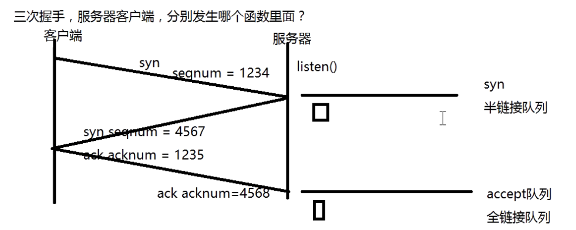

多个客户端如何区分哪个客户端发送的？

sockfd解决不了，只能通过应用协议

### 三次握手



accept()从全连接队列中取出一个结点并分配对应的socket

TCP建立连接之前三次握手对应的状态机也很重要

seqnum:代表对方发数据的索引号

acknum:代表对方已收到我方数据的索引号

Tcp seqnum最大值:4294967295

### 四次挥手


为什么会有time_wait状态？

​	因为如果B未收到ack确认会重发fin，如果没有time_wait，A直接关闭连接，B发送的fin包A无法接收。也有可能下一次连接会收到上一次的fin包

延伸：


#### setsockopt

```
#include <sys/socket.h>

int setsockopt( int socket, int level, int option_name,const void *option_value, size_t ，ption_len);

　　第一个参数socket是套接字描述符。第二个参数level是被设置的选项的级别，如果想要在套接字级别上设置选项，就必须把level设置为 SOL_SOCKET。 option_name指定准备设置的选项，option_name可以有哪些取值，这取决于level，以linux 2.6内核为例（在不同的平台上，这种关系可能会有不同），在套接字级别上(SOL_SOCKET)，option_name可以有以下取值：

    SO_DEBUG，打开或关闭调试信息。
    当option_value不等于0时，打开调试信息，否则，关闭调试信息。它实际所做的工作是在sock->sk->sk_flag中置 SOCK_DBG(第10)位，或清SOCK_DBG位。
    SO_REUSEADDR，打开或关闭地址复用功能。
    当option_value不等于0时，打开，否则，关闭。它实际所做的工作是置sock->sk->sk_reuse为1或0。
    SO_DONTROUTE，打开或关闭路由查找功能。
    当option_value不等于0时，打开，否则，关闭。它实际所做的工作是在sock->sk->sk_flag中置或清SOCK_LOCALROUTE位。
    SO_BROADCAST，允许或禁止发送广播数据。
    当option_value不等于0时，允许，否则，禁止。它实际所做的工作是在sock->sk->sk_flag中置或清SOCK_BROADCAST位。
    SO_SNDBUF，设置发送缓冲区的大小。
    发送缓冲区的大小是有上下限的，其上限为256 * (sizeof(struct sk_buff) + 256)，下限为2048字节。该操作将sock->sk->sk_sndbuf设置为val * 2，之所以要乘以2，是防
止大数据量的发送，突然导致缓冲区溢出。最后，该操作完成后，因为对发送缓冲的大小 作了改变，要检查sleep队列，如果有进程正在等待写，将它们唤醒。
    SO_RCVBUF，设置接收缓冲区的大小。
    接收缓冲区大小的上下限分别是：256 * (sizeof(struct sk_buff) + 256)和256字节。该操作将sock->sk->sk_rcvbuf设置为val * 2。
    SO_KEEPALIVE，套接字保活。
    如果协议是TCP，并且当前的套接字状态不是侦听(listen)或关闭(close)，那么，当option_value不是零时，启用TCP保活定时 器，否则关闭保活定时器。对于所有协议，该操
作都会根据option_value置或清 sock->sk->sk_flag中的 SOCK_KEEPOPEN位。
    SO_OOBINLINE，紧急数据放入普通数据流。
    该操作根据option_value的值置或清sock->sk->sk_flag中的SOCK_URGINLINE位。
    SO_NO_CHECK，打开或关闭校验和。
    该操作根据option_value的值，设置sock->sk->sk_no_check。
    SO_PRIORITY，设置在套接字发送的所有包的协议定义优先权。Linux通过这一值来排列网络队列。
    这个值在0到6之间（包括0和6），由option_value指定。赋给sock->sk->sk_priority。
    SO_LINGER，如果选择此选项, close或 shutdown将等到所有套接字里排队的消息成功发送或到达延迟时间后>才会返回. 否则, 调用将立即返回。
    该选项的参数（option_value)是一个linger结构：
        struct linger {
            int   l_onoff;   
            int   l_linger;  
        };
如果linger.l_onoff值为0(关闭），则清 sock->sk->sk_flag中的SOCK_LINGER位；否则，置该位，并赋sk->sk_lingertime值为 linger.l_linger。
    SO_PASSCRED，允许或禁止SCM_CREDENTIALS 控制消息的接收。
    该选项根据option_value的值，清或置sock->sk->sk_flag中的SOCK_PASSCRED位。
    SO_TIMESTAMP，打开或关闭数据报中的时间戳接收。
    该选项根据option_value的值，清或置sock->sk->sk_flag中的SOCK_RCVTSTAMP位，如果打开，则还需设sock->sk->sk_flag中的SOCK_TIMESTAMP位，同时，将全局变量
netstamp_needed加1。
    SO_RCVLOWAT，设置接收数据前的缓冲区内的最小字节数。
    在Linux中，缓冲区内的最小字节数是固定的，为1。即将sock->sk->sk_rcvlowat固定赋值为1。
    SO_RCVTIMEO，设置接收超时时间。
    该选项最终将接收超时时间赋给sock->sk->sk_rcvtimeo。
    SO_SNDTIMEO，设置发送超时时间。
    该选项最终将发送超时时间赋给sock->sk->sk_sndtimeo。
    SO_BINDTODEVICE，将套接字绑定到一个特定的设备上。
    该选项最终将设备赋给sock->sk->sk_bound_dev_if。
 SO_ATTACH_FILTER和SO_DETACH_FILTER。
    关于数据包过滤，它们最终会影响sk->sk_filter
```


#### 端口重用

```
int option = 1;
setsockopt(sock,SOL_SOCKET,SO_REUSEADDR,(void*)&option,sizeof(option));
```

#### keepalive

```
 #include <netinet/tcp.h>
 setsockopt(sockfd, SOL_SOCKET, SO_KEEPALIVE, (const void *)&optval, sizeof(optval)
 if (setsockopt(sockfd, IPPROTO_TCP, TCP_KEEPIDLE, (const void *)&idle, sizeof(idle)) < 0) {
        perror("setsockopt error");
        exit(EXIT_FAILURE);
    }
    if (setsockopt(sockfd, IPPROTO_TCP, TCP_KEEPINTVL, (const void *)&interval, sizeof(interval)) < 0) {
        perror("setsockopt error");
        exit(EXIT_FAILURE);
    }
    if (setsockopt(sockfd, IPPROTO_TCP, TCP_KEEPCNT, (const void *)&count, sizeof(count)) < 0) {
        perror("setsockopt error");
        exit(EXIT_FAILURE);
    }
```

