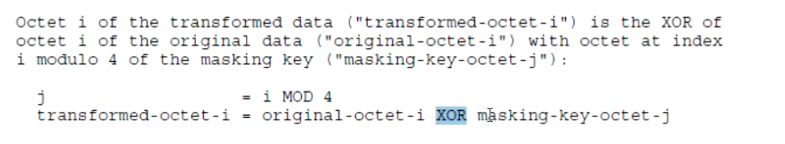

### Websocket（基于Tcp，兼容Http，适合长连接）

---

需要服务器主动推送信息至浏览器就选websocket协议

在tcp三次握手之后，websocket会再进行一次握手。

区别Websocket和Http：查看Connection

### 1.握手


#### websocket的GUID是固定的:**258EAFA5-E914-47DA-95CA-C5AB0DC85B11**

#### key值是由浏览器生成并发送的请求头中

#### SHA1是openssl库中的函数（SHA1(unsigned char * begin,int length,unsigned char *  ans)）

### 2.生成base64编码的代码

```c++
#include <iostream>
#include <string>

std::string base64_encode(const std::string &in) {
    std::string out;

    int val = 0, valb = -6;
    for (unsigned char c : in) {
        val = (val << 8) + c;
        valb += 8;
        while (valb >= 0) {
            out.push_back("ABCDEFGHIJKLMNOPQRSTUVWXYZabcdefghijklmnopqrstuvwxyz0123456789+/"[(val >> valb) & 0x3F]);
            valb -= 6;
        }
    }
    if (valb > -6)
        out.push_back("ABCDEFGHIJKLMNOPQRSTUVWXYZabcdefghijklmnopqrstuvwxyz0123456789+/"[((val << 8) >> (valb + 8)) & 0x3F]);

    return out;
}
```

### 握手成功，下面是数据传输格式(二进制)


#### 定义小端结构体


### 如果mask置为1

计算掩码的方法



