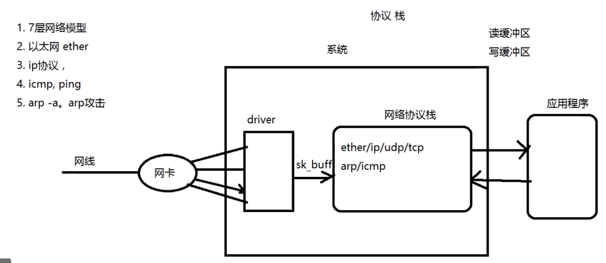

### 用户态网络协议栈

driver:网卡驱动

协议栈：按照相反的顺序进行解析

### 要实现一个协议栈

1.要拿到最原始的数据（以太网的数据）

​	a. raw socket(系统原生的socket，而不是socket()创建的socket)

​	b. 旁路(做一个driver拿到sk_buff)   1.netmap     2.dpdk

​	c. hook (将系统调用的接口hook调)

​	d. bpf / ebpf

