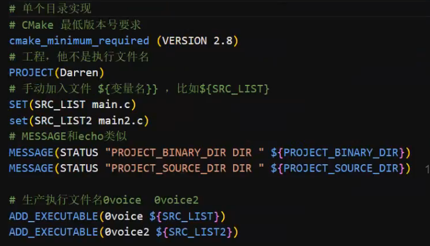
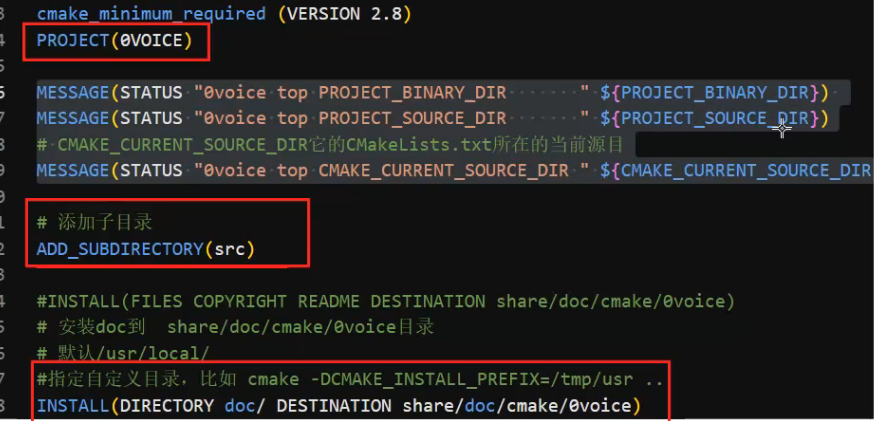
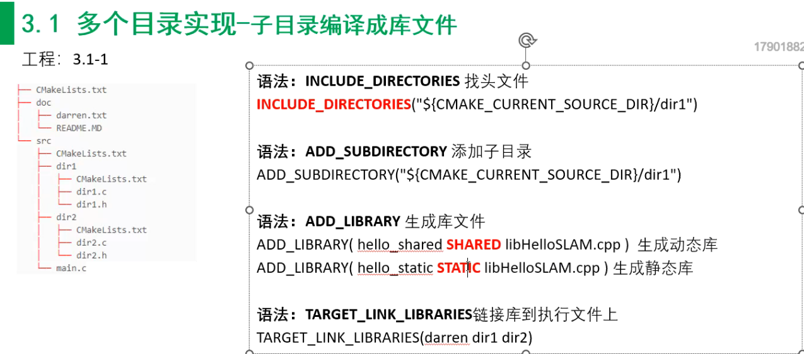
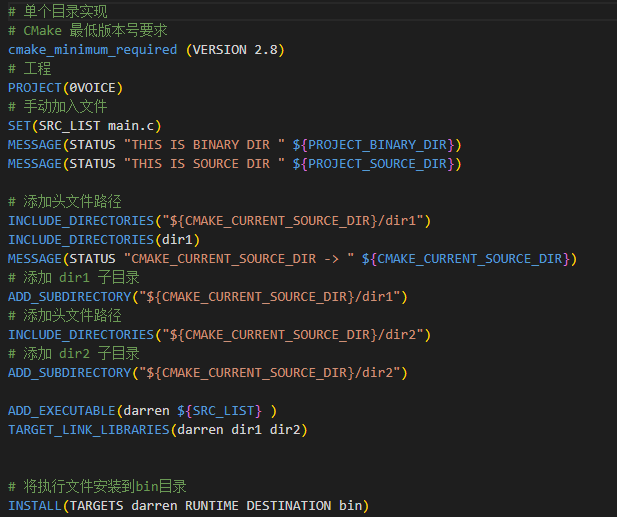
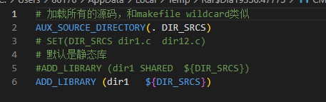
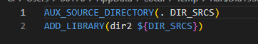

[参考-CMake实战 (yuque.com)](https://www.yuque.com/linuxer/xngi03/cs5y85?#4adqE)

[(94条消息) g++编译参数---CMake详细使用教程---Linux--基于VSCode和CMake实现C/C++开发--笔记_cmake g++_方池安夏的博客-CSDN博客](https://blog.csdn.net/A_With_better/article/details/123637261)

## cmake(对makefile进行的封装)







例：



子目录dir1：



子目录dir2：



### CMake路径

CMAKE_ARCHIVE_OUTPUT_DIRECTORY：默认存放静态库的文件夹位置；
CMAKE_LIBRARY_OUTPUT_DIRECTORY：默认存放动态库的文件夹位置；
LIBRARY_OUTPUT_PATH：默认存放库文件的位置，如果产生的是静态库并且没有指定 CMAKE_ARCHIVE_OUTPUT_DIRECTORY 则存放在该目录下，动态库也类似；
CMAKE_RUNTIME_OUTPUT_DIRECTORY：存放可执行软件的目录；

### install

```
install(TARGETS MyLib
        EXPORT MyLibTargets 
        LIBRARY DESTINATION lib  # 动态库安装路径
        ARCHIVE DESTINATION lib  # 静态库安装路径
        RUNTIME DESTINATION bin  # 可执行文件安装路径
        PUBLIC_HEADER DESTINATION include  # 头文件安装路径
        )
```

```
SET(CMAKE_BUILD_WITH_INSTALL_RPATH TRUE) 
SET(CMAKE_INSTALL_RPATH "\${ORIGIN}/lib") #指定运行时动态库的加载路径,ORIGIN指运行文件所在目录
```

