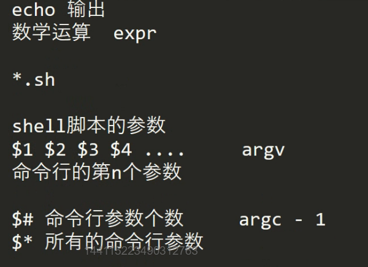
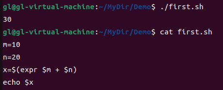
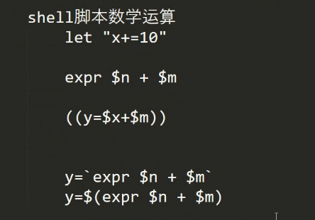
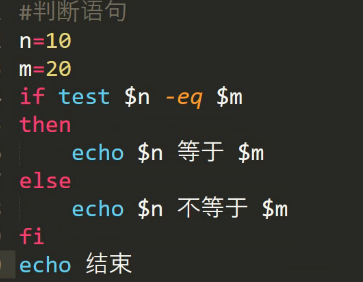
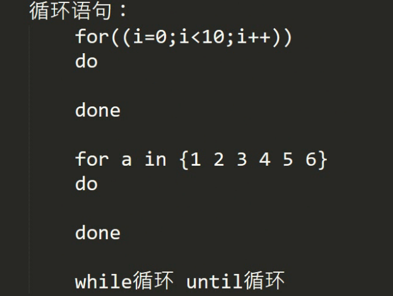

# Shell脚本

详见[00_Linux环境与Shell脚本.pdf](file:///D:/零声Linux/00_Linux环境与Shell脚本.pdf)

Shell脚本[菜鸟编程][Shell 教程 | 菜鸟教程 (runoob.com)]:https://www.runoob.com/linux/linux-shell.html

Shell 语法		$取值

​						let   "x+=1"将x+=1

​						``反引号拿到返回值

​					if	判断

​				for	循环

​												

