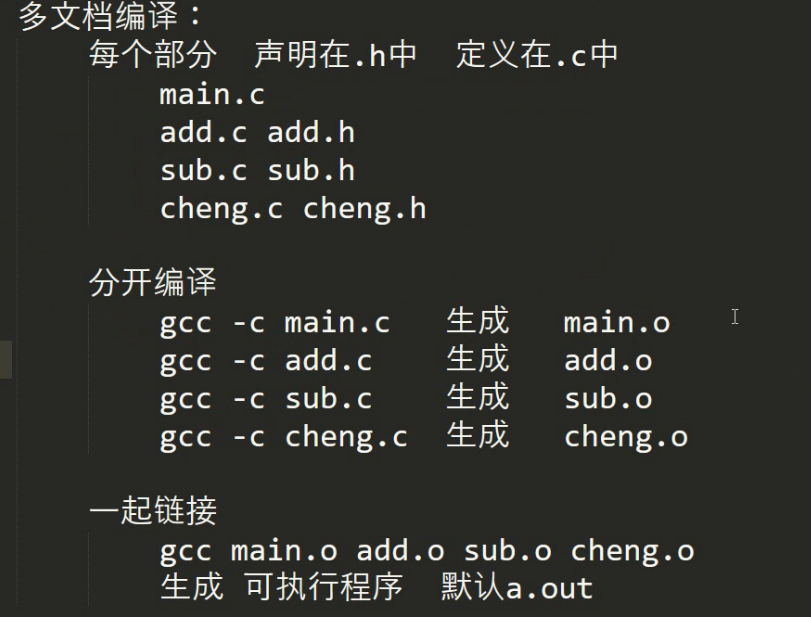

## 语言的分类

### 	解释性语言

​		源代码				---->(编译器)				可执行文件	库(动态库、静态库)

​		如：汇编语言	C	C++	Java	C#	objective-c

### 	脚本语言

​		源代码就是可执行文件

​		shell		JavaScript		Python

### 	(超文本语言)

​		html

## 编译器

### 	Linux：GUN	命令

### 	Windows：集成开发环境	VS系列	DevC++	VC++6.0	QtCreator

---

## 程序从源代码到可执行程序中间经历哪些步骤

1. 预处理	预处理指令执行						宏	宏的展开（将代码中的宏全部替换）

   ```gcc -E test.c```	linux的仅做预处理命令，不会保存

   ```gcc -E test.c >test.txt```	想要保存就将预处理的结果重定向到test.txt

2. 预编译：

3. 编译：和预编译一起完成：语法检查	程序优化	生成目标程序.o（二进制文件）

   ```gcc -c test.c 
   gcc -c *.c	//默认生成*.o文件
   gcc -c *.c -o *.o	//指定生成自己命名的文件
   gcc -S *.c //生成汇编语言文件
   gcc -S *.c -o *.s	//指定生成汇编语言文件
   ```

4. 链接：把多个目标程序，包括库链接成一个可执行程序文件

   ```
   gcc 1.o 2.o 3.o			//默认生成a.out文件
   gcc 1.o 2.o 3.o -o *.exe	//生成*.exe文件
   ```

   多文件编译：

   

   

## gcc编译参数

```
gcc [选项参数] 文件
	-E 			# 预处理
    -S 			# 生成汇编文件
    -c 			# 生成目标文件
    -o 			# 设置编译结果的名字
    -I 			# 设置要导入的头文件的路径
    -l 			# 设置要链接的库名，例如：使用sqrt、pow等数学函数时就需要链接数学库 -lm
    -L 			# 设置要链接的库的路径
    -D 			# 在编译时定义宏
    -g 			# 编译时添加调试信息，这样编译出的程序可以用gdb调试。
    -Wall 		# 显示所有警告，编译器会以更严格的标准检查代码 
    -Werror 	# 把警告当错误处理
    -std 		# 指定编译器要遵循的语法标准，c89,c99,c11，当前系统默认的是c99标准。
    -pedantic 	# 对不符合ANSI/ISO C语言标准的，扩展语法产生警告
```

## gcc相关文件类型

```
	xxx.h 		# 头文件
    xxx.c 		# 源文件
    xxx.i 		# 预处理文件
    xxx.s 		# 汇编文件
    xxx.o 		# 目标文件
    xxx.h.gch 	# 头文件的编译结果，用于检查自定义的头文件是否有语法错误，建议立即删除
    libxxx.a 	# 静态库文件,Windows系统下的静态库文件以lib结尾，例：xxx.lib
    libxxx.so 	# 动态库文件,Windows系统下的动态库文件以以dll结尾，例：libxxx.dll

```

## gcc生成可执行程序的过程

```
# 1、把程序员所编写的代码进行预处理
gcc -E hello.c 				# 把预处理的结果显示到屏幕上
gcc -E hello.c -o hello.i 	# 会生成以.i结尾的预处理文件

# 2、把预处理的结果翻译成汇编代码
gcc -S hello.i 				# 会生成以.s结尾的汇编文件

# 3、把汇编代码翻译成二进制指令
gcc -c hello.s 				# 会生成以.o结尾的目标文件

# 4、把若干个文件目标文件、库文件合并成可执行文件
gcc a.o b.o c.o ... 		# 默认会生成a.out可执行文件，也。
gcc a.o b.o c.o -o hello 	# 可以使用-o指定可执行文件的名字

```

## gcc支持的预处理指令

```c++
#include      // 将指定文件的内容插至此指令处
#include_next // 与#include一样，但从当前目录之后的目录查找，极少用
#define       // 定义宏
#undef        // 删除宏
#if           // 判定
#ifdef        // 判定宏是否已定义
#ifndef       // 判定宏是否未定义
#else         // 与#if、#ifdef、#ifndef结合使用
#elif         // else if多选分支
#endif        // 结束判定
##            // 连接宏内两个连续的字符串
#             // 将宏参数扩展成字符串字面值
#error        // 预处理时产生错误，结束预处理
#warning      // 预处理时产生警告信息
#pragma       // 提供额外信息的标准方法，可用于指定平台
#pragma GCC dependency <文件>     // 若<文件>比此文件新则产生警告
#pragma GCC poison <标识>         // 若出现<标识>则产生错误
#pragma pack(1/2/4/8)             // 按1/2/4/8字节对齐补齐
#line                             // 指定行号

```

## gcc预定义的宏

```c++
void printf_macro (void) 
{
	printf ("__BASE_FILE__     : %s\n", __BASE_FILE__);
	printf ("__FILE__          : %s\n", __FILE__);
	printf ("__LINE__          : %d\n", __LINE__);
	printf ("__FUNCTION__      : %s\n", __FUNCTION__);
	printf ("__func__          : %s\n", __func__);
	printf ("__DATE__          : %s\n", __DATE__);
	printf ("__TIME__          : %s\n", __TIME__);
	printf ("__INCLUDE_LEVEL__ : %d\n", __INCLUDE_LEVEL__);
	printf ("__cplusplus       : %d\n", __cplusplus);
}
```

## gcc生成动态库、静态库

```
gcc -c -fPIC a.c
gcc -shared a.o -o liba.so -I/. -lpthread
gcc -Wl,-rpath=./ main.c -o main -I./ -la -lpthread -L./ //W进程之间传递数据 l链接器，告诉链接器动态库位置
```

### 升级

```
~$ sudo apt-get update
~$ sudo apt-get install gcc-10
~$ sudo apt-get install g++-10
~$ cd /usr/bin
~$ sudo rm gcc g++
~$ sudo ln -s gcc-10 gcc
~$ sudo ln -s g++-10 g++


```

