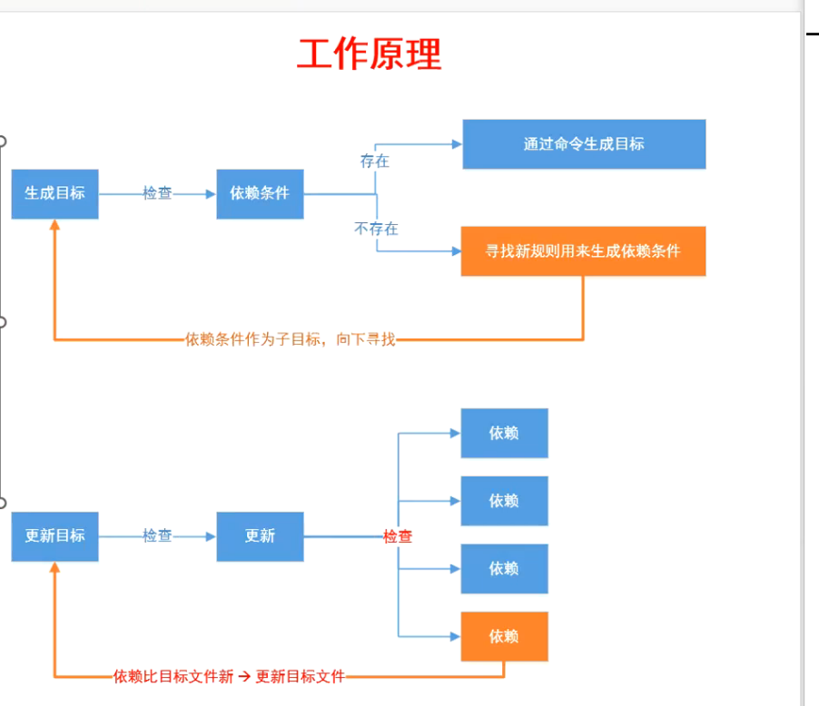
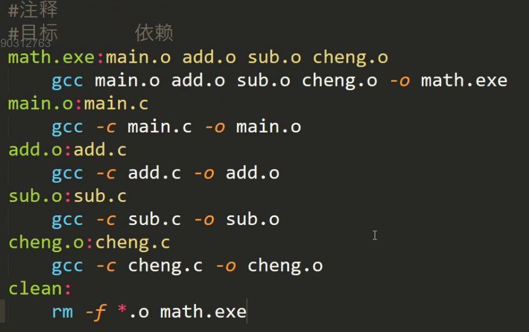
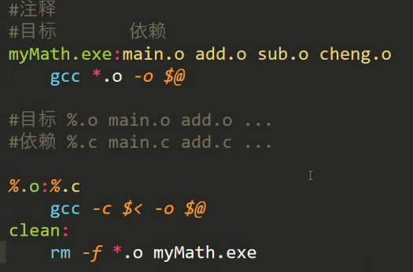
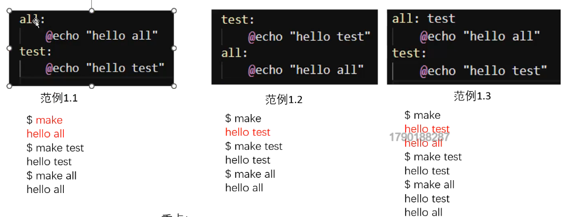
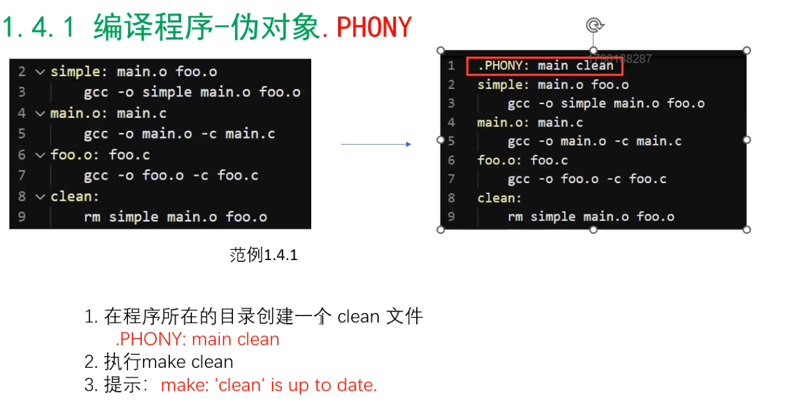
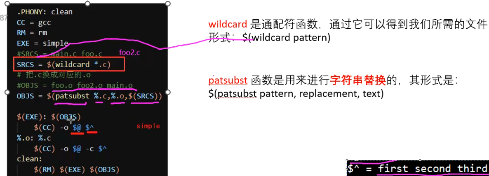
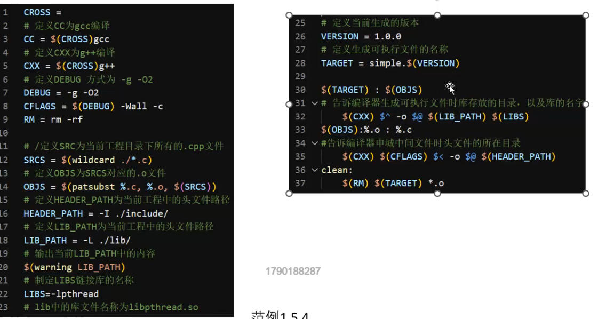

# makefile文件的编写

[参考-Makefile实战 (yuque.com)](https://www.yuque.com/linuxer/xngi03/nfsm1k?)



例：



---

第二种写法：

$@	（可理解为替代可执行文件）目标

%	一个一个通配文件

$<	代表依赖	并且	是一个个代表



---

C++:	源程序*.cpp	编译器 g++

C语言：	源程序*.c	编译器 gcc


执行Makefile文件要使用make命令

make跟-f	[filename]   + Makefile文件中写的内容

##### make执行顺序



```
命令行输入make，默认执行第一个
Mike:
	@echo "Hello Mike"
命令行输入make Mike
```

makefile如果有依赖就先生成最底层的

#### .PHNOY(解决本地文件存在同名的问题)




### 自动编译变量



### 依赖第三方库

