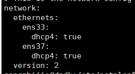
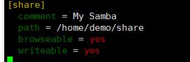
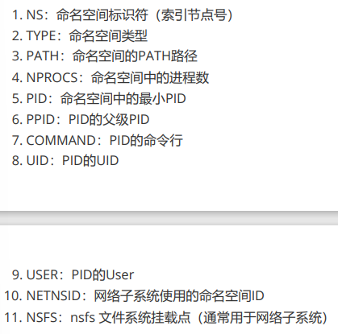

# Linux常用命令

## ls 查看文件

​	默认查看当前工作目录下的文件

​	-a查看所有的文件（包括隐藏文件）

​	-l显示文件的详细信息

​	-ll 等同于ls -l

​	类型			权限			数量		绝对用户		当前用户		最终修改时间

---

小知识：用户的所有命令都在/usr/bin中

## mkfifo 创建管道文件

 ```mkfifo a.dat```

---

## echo 输出

用 > 重定向

```echo "你好" > a```       向a文件输入"你好"

```echo "你好"```				将"你好"输出到终端

---

## touch 创建文件，如果文件已存在则修改最终修改时间


---

## mkdir 创建空目录

---

## chmod 修改文件权限

当前用户权限   当前用户同组人  其他人

u							g						o

r 读			4			100

w 写		   2			010

x 执行		1			001

一个1位的八进制整数					一个权限

​	一位八进制等同于三位二进制

一个3位的八进制整数					一个文件三种人的权限

chmod	+x	a		给a的ugo都加上x权限

chmod	0666	a		设置a的权限为0666，ugo都是读写权限

---

## mv 将文件移动到某个文件夹，也可以实现文件的重命名

```mv a b c d A```其中abcd为文件，A为文件夹

```mv a.bat b.bat```将a.bat重命名为b.bat

-f	覆盖前不询问

-i	覆盖前询问

-n	不覆盖已存在的文件

---


## cp拷贝文件

```cp a b c A```将abc拷贝到A目录

-r	可以拷贝文件夹

---

## rm 删除文件

​	-r	递归删除(可以删除文件夹)

​	-f	强制删除

通配符：

  * *任意个任意字符

    ```rm -f *a```删除文件名为任意个任意字符+a的文件

  * ？一个任意字符

    ```rm -f ?a```删除文件名为任意一个字符+a的文件

---

## rmdir删除空文件夹

---

## man 查看帮助文档

man +要查看的内容（q退出帮助文档）

---

## history查看命令历史

---

## g++

```shell
-I //引入include头文件
```

```
-l //引入lib库
```

## 查看cpu

htop

## 解压命令

#### tar -xzvf  解压.tar  .tar.gz    tar.Z文件

#### tar -xjvf解压.tar.bz2文件（需要下载bzip2）

#### tar -xvf 解压.tar.xz文件

#### gzip -d 解压.gz文件
#### bzip2 -d解压.bz2文件
#### unrar x 解压.rar文件
#### unzip 解压.zip 文件


## 安装、删除命令
### 删除nginx，–purge包括配置文件

```
sudo apt-get --purge remove nginx
```

### 1.2 自动移除全部不使用的软件包

```
sudo apt-get autoremove
```

### 1.3 罗列出与nginx相关的软件

```
dpkg --get-selections|grep nginx
```

```
执行1.3的结果:
stephen@stephen-OptiPlex-390:~$ dpkg --get-selections|grep nginx
nginx                       install
nginx-common                    install
nginx-core                  install
```

### 1.4 删除1.3查询出与nginx有关的软件

```
sudo apt-get --purge remove nginx
sudo apt-get --purge remove nginx-common
sudo apt-get --purge remove nginx-core
```

### 1.5取消安装不必要的组件
```
apt --no-install-recommends install asciidoc
```

### 查看ubuntu发行版(需要根据这个确定apt换源)

```
lsb_release -a
```

### apt源

ubuntu 20.04

阿里云:

```
deb http://mirrors.aliyun.com/ubuntu/ focal main restricted universe multiverse
deb-src http://mirrors.aliyun.com/ubuntu/ focal main restricted universe multiverse
deb http://mirrors.aliyun.com/ubuntu/ focal-security main restricted universe multiverse
deb-src http://mirrors.aliyun.com/ubuntu/ focal-security main restricted universe multiverse
deb http://mirrors.aliyun.com/ubuntu/ focal-updates main restricted universe multiverse
deb-src http://mirrors.aliyun.com/ubuntu/ focal-updates main restricted universe multiverse
deb http://mirrors.aliyun.com/ubuntu/ focal-proposed main restricted universe multiverse
deb-src http://mirrors.aliyun.com/ubuntu/ focal-proposed main restricted universe multiverse
deb http://mirrors.aliyun.com/ubuntu/ focal-backports main restricted universe multiverse
deb-src http://mirrors.aliyun.com/ubuntu/ focal-backports main restricted universe multiverse
```

Ubuntu 23.04

阿里云：

```
# aliyun
deb http://mirrors.aliyun.com/ubuntu/ lunar main restricted universe multiverse
deb-src http://mirrors.aliyun.com/ubuntu/ lunar main restricted universe multiverse
deb http://mirrors.aliyun.com/ubuntu/ lunar-security main restricted universe multiverse
deb-src http://mirrors.aliyun.com/ubuntu/ lunar-security main restricted universe multiverse
deb http://mirrors.aliyun.com/ubuntu/ lunar-updates main restricted universe multiverse
deb-src http://mirrors.aliyun.com/ubuntu/ lunar-updates main restricted universe multiverse
deb http://mirrors.aliyun.com/ubuntu/ lunar-proposed main restricted universe multiverse
deb-src http://mirrors.aliyun.com/ubuntu/ lunar-proposed main restricted universe multiverse
deb http://mirrors.aliyun.com/ubuntu/ lunar-backports main restricted universe multiverse
deb-src http://mirrors.aliyun.com/ubuntu/ lunar-backports main restricted universe multiverse

```

## 查看服务

显示所有服务（命令）：

service --status-all

systemctl --list-units --all type=service

## 网卡配置

网卡配置在 /etc/netplan

使用nmtui命令配置网络

（重要）nmcli命令

##### 配置双网卡（桥接+NAT）

vm虚拟网络编辑器 VM0 设置绑定本机物理网卡

设置网卡自动获取ip



设置网卡为eth:

[Ubuntu 18.04服务器系统修改网卡名称方法记录（只需要四步）_老蒋部落 (itbulu.com)](https://www.itbulu.com/ubuntu-changegrub.html)

##### 命令

```
ip addr查看网络联通设备========================================                                                                                                                                                    
```

## Samba

创建文件映射，由Windows映射到Linux上

修改配置文件/etc/samba/smb.conf

为Samba 用户设置密码 smbpasswd -a 用户名

修改配置信息为：



windows创建网络映射

## 磁盘操作

#### （1）分配磁盘并挂载

fdisk 分配

mkfs.ext4初始化

mount挂载

挂载配置文件/etc/fstab

umount取消挂载

#### 2.df -ha

查看磁盘分配

#### 3.du -lh --max-depth=1

 查看当前目录文件内存占用情况

#### 4.swapon -s

 查看交换分区使用情况

#### （2）拓展逻辑卷

[Ubuntu 20.04 逻辑分区(LVM)扩容_ubuntu逻辑分区_PolarisHuster的博客-CSDN博客](https://blog.csdn.net/john1337/article/details/119749350)

## 查看版本号

lsb_release -a (其中codename与apt换源有关[Ubuntu更换apt源与Codename的关系_ubuntu codename apt源-CSDN博客](https://blog.csdn.net/qq_40965177/article/details/96703426#:~:text=codename 是 Ubuntu 系统的版本代号，如,Ubuntu 20.04的版本代号是focal。 main、restricted、universe和multiverse是 Ubuntu 软件包的四个组件，分别表示主要软件、受限制的软件、非免费软件和不常用的软件。))

uname -a

## 进程

#### lsns 

-p、--task<pid>//打印进程命名空间



lsns更多细节查看

[3.docker容器隔离.pdf](file:///D:/零声Linux/docker/3.docker容器隔离.pdf)

## service安装

#### telnet

[ubuntu 14.04中打开telnet服务步骤 – McGrady的技术分享 (tracymc.cn)](https://www.tracymc.cn/archives/3797)

## 时间

date	查看时间

timedatectl	设置时间/时区

```
sudo timedatectl set-timezone 'Asia/Shanghai'
```

