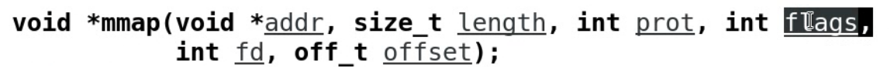

# 文件

​		文件内容操作：

​				创建，打开文件

​				读写文件

​				文件内容指针操作

​				关闭保存文件

​		C：FILE*  	fopen	fread	fwrite	fscanf	fprintf	fseek	fclose 

​		C++:	fstream	.open	.read	.write...

​		windows:	HFILE	CreateFilre	ReadFile	WriteFile

​		Linux: int fd;//文件描述符

例子：

---

隔space个字符取出文件内容

void   lseek(int fd, int  space ,SEEK_CUR);

# 文件操作

## 文件拷贝

注意：open函数在#include<fcntl.h>中

# 获取文件信息

man 2 stat		--	获取stat函数(文件信息)：成功返回0，失败返回 -1

man 2 unlink 	--	获取unlink函数(删除文件)

# 文件映射(把文件映射到内存中,操作内存段就是操作文件)

​	文件	-->	硬盘

​	硬盘	容量大	访问速度慢	价格便宜	掉电不流失

​	内存	容量小	访问速度快	价格贵		掉电流失

​	io操作	读写文件			写：内存->硬盘		读：硬盘->内存

#### **文件映射虚拟内存编程模型**

###### 1.打开文件										open

###### 2.修改文件大小								ftruncate(int fd,int length)

###### 3.挂载映射										mmap

参数：1.地址	2.长度	3.保护方式（一般用默认，写0）	4.映射方式	5.文件表示符号	6.文件中的偏移量

flags: PROT_EXEC(可执行)	PROT_READ(可读)	PROT_WRITE(可写)	PROT_NONE(无法访问)	MAP_SHARD(共享给不同进程)	MAP_PRIVATE(进程私有)	

###### 4.使用虚拟内存(文件)				  指针方式

###### 5.卸载映射									munmap

###### 6.关闭文件									close

​	

​	