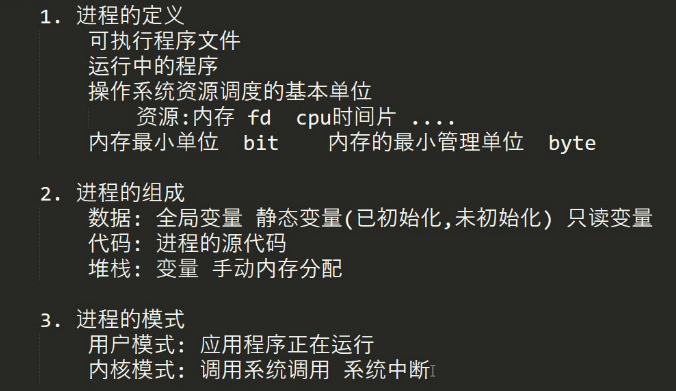
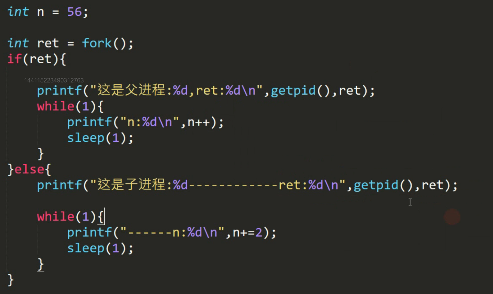
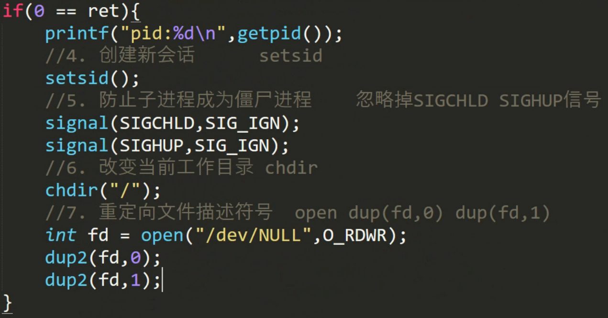

# 进程

有关进程的命令:		ps	-aux	显示所有进程的详细信息

​									top	

​									nice	renice	控制进程是否让步(降低进程优先级)

​									kill	杀死进程

​									crontab	切换前后台

​									bg

### 如何创建进程

* system();//在程序中执行命令

  创建完后，当前进程不再执行了(挂起)，等被创建进程结束后再继续运行

* fork()     vfork()

  创建子进程：当前进程是父进程。创建完成后父子进程同时执行
  
  拷贝方式来创建，fork()函数创建子进程，子进程拷贝父进程所有的代码并记录进程上下文(运行到什么时候，即接着fork运行，fork前也会拷贝但不会运行(包括fork))
  
  fork返回值：
  
  父进程返回值为子进程ID
  
  子进程返回值为0
  
  
  
* exec簇 （相当于Windows中的OpenProcess）

  execl		execv	execle	execlp	execvp

### 进程的状态

​	运行时，睡眠，挂起，等待，死亡，僵死

### 进程的结束

​	僵尸进程：父进程创建了子进程，父进程先与子进程结束，子进程资源没有被释放，就会变成僵尸进程，持续占用系统资源（1.内核中有一棵树，树节点是进程数据	2.进程本身资源）

​	 子进程结束前会向父进程发送SIGCHILD信号，父进程受到信号后，回收子进程资源，然后父进程再结束。

​	父进程	写一个	wait()	等待子进程发送SIGCHILD信号

​									waitpid()

#### 守护进程

​	1.独立的进程，记录其他进程的情况，记录操作系统的状态		系统日志

​	2.如何查看当前系统的守护进程

​		ps     -axj

​		PXJID为-1的为守护进程

​	3.如何创建守护进程

  * 守护进程的功能实现和其他进程一样

  * 如果希望把一个进程变成守护进程

    ​	（1）把他的父进程干掉

    ​	（2）摆脱终端的控制

    ​				关闭 0	1	2（文件描述符号）

    ​				0（标准输入设备）1（标准输出设备）2（标准错误输出设备）

    ​				重定向当前进程的io操作到			/dev/null			黑洞设备

    ​	（3）创建新的会话

    ​				摆脱原有会话、进程组的控制

    4.守护进程创建编程模型

    ​	第一种：
    ​	1. 创建新会话			setsid
    ​	2.改变当前工作目录		  chdir
    ​	3.重设当前文件权限		  umask
    ​	4.关闭文件				 close

    第二种：

    ​	1.重设文件权限	umask

    ​	2.创建子进程		fork

    ​	3.让父进程结束

    ​	4.创建新会话		setsid

    ​	5.防止子进程变成僵尸进程	忽略掉SINCHILD	SIGHUP信号

    ​	6.改变当前工作目录	chdir

    ​	7.重定向文件描述符号	open  	dup2（fd,0）	dup2  (fd,1)	

    ​	umask(0);

    ​	int	ret=fork();

    ​    if(ret>0) printf("父进程结束\n")；

    

    #### 进程的组织形式

​		多个进程组成一个进程组		进程组的组长（session进程）

​		多个进程组组成一个会话 

​		