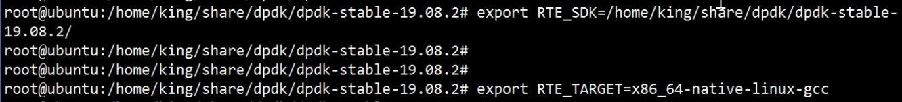

### dpdk环境搭建

[VMWare+ubuntu+DPDK环境搭建.pdf](file:///D:/零声Linux/dpdk/VMWare+ubuntu+DPDK环境搭建.pdf)

修改网卡为eth：

[Ubuntu 18.04服务器系统修改网卡名称方法记录（只需要四步）_老蒋部落 (itbulu.com)](https://www.itbulu.com/ubuntu-changegrub.html)

注意事项：

​	千万不要用校园网，会导致ping不通外网

​	除了运行grub脚本（grub-mkconfig）生成配置文件，还可以使用sudo update-grub

### 运行dpdk

1.查看网卡是否为物理网卡eth，而不是ens虚拟网卡

2.检查该网卡是否支持多队列

```
cat /proc/interrupts | grep eth0
```

​	看有没有多个中断，只有一个说明不支持多队列

3.需要设置变量



RTE_SDK设置本目录，运行时路径

RTE_TARGET=x86)64-native-linux-gcc

./usertools/dpdk-setup.sh

选择43-49全部

### 运行条件：

1.CPU的数量是2的幂

2.使用dpdk的时候需要root权限

#### 设置网卡多队列

直接配置对应虚拟机vmx文件

找到  virtualDev改为=vmxnet3

### 设置页的大小

在/etc/default/

### dpdk C++

将dpdk  example中的makefile 复制一份到项目目录，更改其中的APP： 和源文件

```c++
#include<rte_eal.h>
rte_eal_init(argc,argv);//检验dpdk环境，必须要有
rte_exit(EXIT_FAILURE,"提示信息");//退出
mbuf_pool=rte_pktmbuf_pool_create("mbuf名字",mbuf_num,0,0,RTE_MBUF_DEFAULT_BUF_SIZE,rte_socket_id())
rte_eth_dev_configure(port_id，rx,tx,eth_config)//port_id 逻辑值,rx接收队列数量,tx发送队列数量
rte_eth_rx_queue_setup(port_id,rxid,128,rte_eth_dev_socket_id(),NULL,mbuf_pool)//rxidP:rx队列id
rte_eth_dev_start(port_id);//开始


struct rte_mbuf* mbufs[Buff_size];
rte_eth_rx_brust(port_id,0，mbufs,Budd_size)//接收读队列数据
    
//宏
struct rte_eher_dhr *ehdr = rte_pktmbuf_mtod(mbufer[i],struct rte_ether_hdr*);

```

