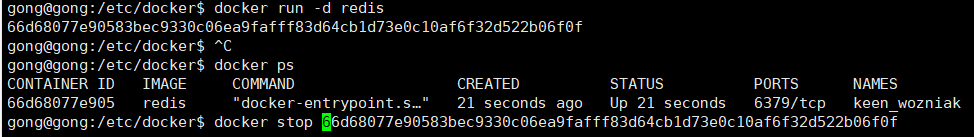

### docker安装

[如何在 Ubuntu 20.04 上安装和使用 Docker-阿里云开发者社区 (aliyun.com)](https://developer.aliyun.com/article/762674)

### docker换源

[(99条消息) Docker设置国内镜像源_docker国内镜像源_讓丄帝愛伱的博客-CSDN博客](https://blog.csdn.net/ximaiyao1984/article/details/128595319)

[1. docker 环境准备.pdf](file:///D:/零声Linux/docker/1. docker环境准备.pdf)

解决docker需要root权限运行的问题

```
cat /etc/group | grep docker #查看是否存在docker组
sudo gpasswd -a $USER docker     #将登陆用户加入到docker用户组中
newgrp docker     #更新用户组
docker ps -a  
```

#### docker info ：WARNING: No swap limit support

[Docker info 查看报错 WARNING: No swap limit support 解决 - 西瓜君~ - 博客园 (cnblogs.com)](https://www.cnblogs.com/yangzp/p/15672475.html)

#### docker driver :修改为systemd

[配置 Docker 的 cgroup driver 为 systemd - 知乎 (zhihu.com)](https://zhuanlan.zhihu.com/p/633832183)

### docker架构

[2. docker介绍.pdf](file:///D:/零声Linux/docker/2. docker介绍.pdf)

### docker容器隔离

[3.docker容器隔离.pdf](file:///D:/零声Linux/docker/3.docker容器隔离.pdf)

### docker常用命令

[4. docker 常用命令.pdf](file:///D:/零声Linux/docker/4. docker 常用命令.pdf)


### docker events监听

```
docker events//监听docker状态
```

### docker pull拉取镜像

```
docker search redis
docker pull redis
```

### docker logs日志

```
docker logs -h
docker logs -n 10 redis
docker logs -f redis//随着容器的运行打印日志
```

### docker history

```
docker history redis//查看容器构建历史
```

### docker login/logout
```
docker login --username=root --password=123
```
### docker push


# 容器

### docker run

docker run：运行容器 使用docker run命令可以运行一个已经存在的镜像，并创建一个新的容器(等于先docker create 在docker start)。该命令的语法如下：

```
docker run [OPTIONS] IMAGE [COMMAND] [ARG...]
```

其中，OPTIONS可以包括以下参数：

- -d：后台运行容器；

- -p：映射端口；

- --name：指定容器名称；(需在其他参数之前使用)

- --rm：容器退出时自动删除。

- -i :以交互模式

- -t: 分配一个假终端(与-i可连写为-it)

  ```
  -it是创建的交互式:创建完成之后直接进度终端
  -id是创建守护式:创建完成之后不进入容器
  -it创建的容器exit,后台不会继续运行
  -id创建的容器exit,后台继续运行
  ```

- --entrypoint:修改容器进入命令

- --health-cmd:启动容器时执行健康检查命令

- --health-interval:健康检查频率,需要指定单位，如2s

- --health-retries:重试次数

- --health-start-period:容器启动时间(当处于这个时间段时，health不作数，因为一些容器需要加载大量的缓存)

- --health_timeout:单次命令的超时时间

### docker停止后台运行的容器

(1)通过container id停止

```
//先查看容器id
docker ps
//停止容器
docker container stop <容器id>
//停止并移除容器
docker container rm -f <容器id>
```

(2)通过创建容器时产生的id停止

```
docker stop id//dockerstop会向Docker容器发送一个停止信息（SIGTERM信号（默认15）），让容器内的应用程序自行关闭并做好一些收尾工作。但如果应用程序没有正常关闭，那么会等待一段时间（默认为10秒）后再发送一个强制停止信息（SIGKILL信号（9））来关闭容器
```



docker stop：停止容器 使用docker stop命令可以停止一个正在运行的容器，**但容器还存在**。该命令的语法如下：

```
docker stop [OPTIONS] CONTAINER [CONTAINER...]
```

其中，OPTIONS可以包括以下参数：

- -t：停止容器前等待的秒数。

(3)通过docker kill +容器id

```
docker kill id//可能会丢失数据
docker kill -s KILL id(或名称) //等同于docker kill -s 9 id
```

### docker build

docker build：构建镜像 使用docker build命令可以根据Dockerfile文件构建出一个新的镜像，该命令的语法如下：

```
docker build [OPTIONS] PATH | URL | -
```

其中，OPTIONS可以包括以下参数：

- -t：为镜像设置标签；
- --no-cache：不使用缓存；
- --build-arg：设置构建时的参数。

### docker ps

docker ps：列出容器 使用docker ps命令可以列出当前正在运行的容器。该命令的语法如下：

```
docker ps [OPTIONS]
```

其中，OPTIONS可以包括以下参数：

- -a：显示所有容器，包括已经停止的容器；
- -q：只显示容器ID。
- -f :过滤选项

### docker rm

docker rm：删除容器 使用docker rm命令可以删除一个已经**停止**的容器。该命令的语法如下：

```
docker rm [OPTIONS] CONTAINER [CONTAINER...]
```

其中，OPTIONS可以包括以下参数：

- -f：强制删除容器。

#### 删除所有容器

```
docker container rm  $(docker ps -aq)
```

### docker exec

docker exec：在容器内部执行命令 使用docker exec命令可以在容器内部执行一条命令。该命令的语法如下：

```
docker exec [OPTIONS] CONTAINER COMMAND [ARG...]
```

其中，OPTIONS可以包括以下参数：

- -i：以交互模式运行容器；
- -t：为容器分配一个伪终端（tty）。

### docker network

docker network：管理网络 使用docker network命令可以创建、查看和删除Docker网络。该命令的语法如下：

```
docker network [OPTIONS] COMMAND
```

其中，OPTIONS可以包括以下参数：

- -d：指定驱动程序；
- -q：只显示网络ID。 常用的COMMAND包括：
- create：创建一个新的网络；
- ls：列出所有的网络；
- rm：删除一个或多个网络。

### docker pause //docker unpause

暂停容器

### docker inspect +容器

查看容器配置(cgroup)

### docker top + 容器

查看容器进程 

### docker attach +容器

### docker export  -o + 文件名 + 容器

将正在运行容器的文件系统压缩(导出)

### docker import +文件+容器:tag

导出容器的根文件系统为镜像

### docker port +容器

查看容器端口映射

### docker exec + 容器+cmd

执行对应命令

### docker diff +容器

比较容器和镜像的差别（A ：add，C：change）

### docker rename +容器

修改容器名称

### docker stats +容器

容器监控

### docker update

修改容器限制

# 镜像

### docker images

```
docker images//显示可用镜像
docker images -a//显示所有镜像
docker images -f before= //查该镜像之前的镜像
docker images -f dangling=true//查找虚悬镜像
docker images -f label=//查询对应标签值的镜像
docker images -f reference=//查询对应镜像
docker images -f since=//查询该镜像之后的镜像
```

### docker image

```
docker image prune//删除所有虚悬镜像
```

### docker rmi

docker rmi：删除镜像 使用docker rmi命令可以删除一个本地的镜像。该命令的语法如下：

```
docker rmi [OPTIONS] IMAGE [IMAGE...]
```

其中，OPTIONS可以包括以下参数：

- -f：强制删除镜像。

### docker tag

```
docker tag redis:1.0.0 myredis:1.0.1
//推送到远端私有仓库需要tag
docker tag redis:1.0.0 192.168.124.138:5000/myredis
```

### docker save(镜像保存)

与docker export不同，docker export针对的是容器

### docker load(镜像加载)

与docker import不同，docker import针对的是容器

- -i

  导入文件成镜像

### docker commit(将容器提交为镜像)

在保留现场的时候会这么做(快照)

```
docker commit redis myredis:v1.1.1
```

# docker 搭建私有注册中心

[5.docker镜像.pdf](file:///D:/零声Linux/docker/5.docker镜像.pdf)

1.下载registry镜像

```
docker search registy
```

2.拉取镜像

```
docker pull registry:lasted
```

3.创建存取仓库用来镜像的位置

```
mkdir -p $HOME/registry/
mkdir -p $HOME/registry/auth //存放用户信息
mkdir -p $HOME/registry/data	//存放镜像
```

4.安装apache2

```
sudo apt install apache2-utils
```

5.生成用户名、密码

```
htpasswd -Bbn gong 123456 > $HOME/registry/auth/htpasswd
```

6.启用注册中心

```
docker run -d -p 5000:5000 --name registry --restart=always -v $HOME/registry/data:/var/lib/registry -v $HOME/registry/auth:/auth -e "REGISTRY_AUTH=htpasswd" -e "REGISTRY_AUTH_HTPASSWD_REALM=Registry Realm" -e REGISTRY_AUTH_HTPASSWD_PATH=/auth/htpasswd registry:2
```

7.修改服务为可信任

```
vim /lib/systemd/system/docker.service
ExecStart=/usr/bin/dockerd -H fd:// --containerd=/run/containerd/containerd.sock  --insecure-registry localhost:5000
```

# 推送镜像

1.登录对应注册中心

```
docker login 
```

2.修改镜像tag

```
docker tag redis:latest 127.0.0.1:5000/redis:v1.0.0
```

3.推送镜像

```
docker push 127.0.0.1:5000/redis:v1.0.0 
```

注：如果推送不成功，可能是命名空间导致，需要修改registry目录的权限