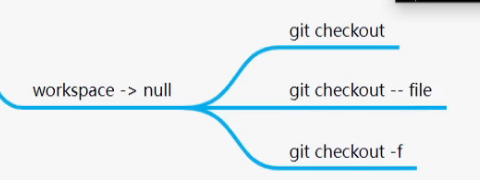
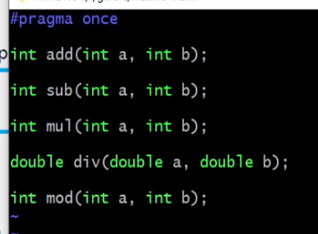

## Git

1.下载git

CentOs/Fedora

```
yum install apt
```

ubuntu/Debian:

```
sudo apt-get install git
```

windows:

http://git-scm.com/download/win 会检查你的操作系统是32位还是64位并自动下载相应安装包

一路next即可

2.生成秘钥和公钥

```shell
ssh-keygen -t rsa -C "邮箱名"
```

windows上生成的秘钥和公钥在C:/用户/用户名/.ssh下

Ubuntu下生成的秘钥和公钥在/home/用户名/.ssh下

3.在远程仓库想要上传的文件目录下建立一个裸仓库

```shell
git init --bare
```

4.连接远程仓库（一般通过ssh协议连接）

将本地git的公钥复制下来，添加进远程git的/home/用户名/.ssh/authorized_keys

注：第一次安装git没有authorized_keys文件，需要新建一个

```
touch authorized_keys 
```

5.clone

将工作目录cd到在想要保存克隆仓库的地方

```
git clone ssh://用户名@ip:/远程仓库的目录  (本地克隆的目录名)
```

​	将远程库添加到本地储存库使用git remote add

6.想要上传，必须初始化用户名和邮箱（任意即可）

在每个克隆下的仓库都需要添加

```
git config user.name "name"
git config user.email "name@qq.com"
```

如果觉得太过麻烦，可以将其设置全局

```
git config --global user.name "name"
git config --global user.email "name@qq.com"
```

单独配置的user的信息保存在对应克隆文件.git中的config中,全局配置的user信息则不会保存

#### git使用


```
git  status 
```

查看当前状态(未将api.h加入缓存区)


将api.h存入暂存区

```
git add api.h
git add add.cc
```


提交到本地仓库

-m 添加日志

```
git commit api.h add.cc -m "feat:add func"
```


推送至远端服务器

```
git push 远端服务器别名(origin) 分支(master) 
```


将上传至远端服务器的文件拉至工作区

```
git pull 
```


查看提交日志

```
git log
```


会生成一个唯一标识id，即版本号

fetch/clone和pull之间是有差别的，通过pull直接将远端服务器中的文件拉入workplace，fetch/clone则是拉入本地git服务器，通过对比两个的版本号，可以知道相差多少版本       

将指定文件从暂存区返回到工作区

```
git restore -S sub.cc
```

将指定文件从本地仓库退回到暂存区

```
git reset --soft + 版本号
```

将指定文件从本地仓库退回到工作区

```
git reset --mixed + 版本号
```

将指定文件从本地仓库删除

```
git reset --hard + 版本号（或者head指针,例：head^）
```

将指定文件从工作区删除



将本次commit合并到上一次commit

```
按照流程从工作区先提交到暂存区
git commit --amend
```

整理多次提交

```
git rebase -i h1 h2
```

显示分支

```
git branch (-a)
```

创建分支

```
git branch 分支名	//不会切换到相应分支
或
git checkout -b 分支名 //会切换到相应分支
```

切换分支

```
git checkout 分支名
或
git switch 分支名
```

合并分支(将develop分支合并到master分支)

(1)拉取master最新数据

(2)先把master合并到develop

(3)然后测试代码

(4)将develop合并到master ，测试如果ok提交到远端

解决冲突：

当不同分支修改了同一个文件的同一行代码、

冲突文件：api.h

```
vim api.h
```


修改为:



冲突解决，开始提交

```
git add .
git commit . -i -m "fix:merge master"     //解决了冲突加上-i
```

 或者

```
git rebase//会改变我的提交id
```

如何判断使用git rebase和git  merge：

​	是否有其他人依赖我当前的分支，如果有人依赖我的分支，那么提交id改变会引发异常 


删除分支

```
git branch -d 分支名
```

删除远端

```
git push origin -d 分支名
```

.git 瘦身

```
git purge 			//删除弃用的分支和标签
git gc				//压缩，清理不用的对象
.gitignore			//编写，忽略文件和文件规则
```

```
# 清理历史记录的大文件
//找出大文件的前五个
git verify-pack -v .git/objects/pack/pack-*.idx | sort -k 3 -g | tail -5
//找出大文件对应的文件名
git rev-list --objects --all | grep 8f10eff91bb6aa2de1f5d096ee2e1687b0eab007
//4.清除该文件的所有历史记录并强制刷新到所有分支(慎重,需要管理员权限,否则报错)
git filter-branch --index-filter 'git rm --cached --ignore-unmatch <your-file-name>'
rm -rf .git/refs/original/
git reflog expire --expire=now --all
git fsck --full --unreachable
git repack -A -d
git gc --aggressive --prune=now
git push --force [remote] master
```


## 使用规范


## 项目对象


  