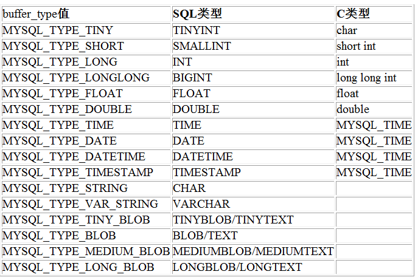
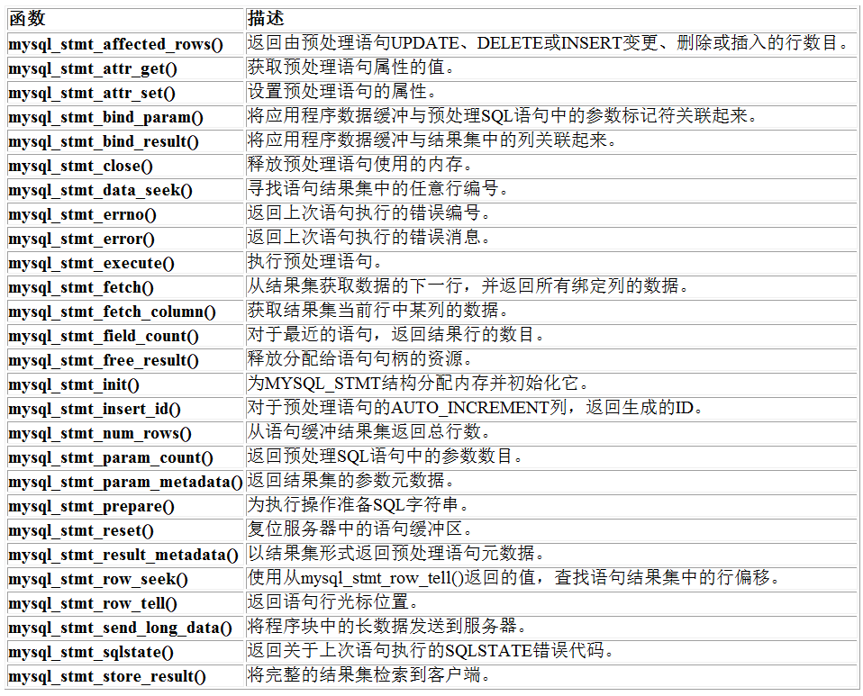

```c++
msyql_init(MYSQL* mysql) //失败返回NULL

mysql_real_connect(MYSQL* mysql,char*IP,char* UName,char* Code,char* DB_Name,int Port,NULL,0)//失败返回NULL

mysql_real_query(MYSQL* mysql,char* query)//失败返回非0

mysql_num_fields(MYSQL_RES* res)//列数
    
mysql_num_rows(MYSQL_RES* res)//行数

MYSQL_RES res=mysql_store_result(MYSQL* mysql)//获取结果集
    
MYSQL_ROW res=mysql_fetch_row(MYSQL_RES* res)//获取一行数据

mysql_free_results(MYSQL_RES* res)//释放结果集，清空缓存，每一次查询之后必须清空结果集

mysql_close(MYSQL* mysql)//关闭数据库

mysql_options(MYSQL*myysql,MYSQL_SET_CHARSET_NAME,"utf8mb4");//设置utf8mb4字符
```

## 图片存储

流程：

1.准备图片，将图片读入内存

2.将图片写入数据库

3.从数据库读出图片到内存

4.将内存中的图片写入磁盘

引入MYSQL_STMT类型和MYSQL_BIND类型,两个值一一对应

采用类比手法形容两者关系

```c++
int mysql_write(MYSQL* mysql, char* buffer, int length)//buffer是图片对应的二进制数组
{
    if (mysql == NULL || buffer == NULL || length <= 0) return -1;
    MYSQL_STMT * stmt = mysql_stmt_init(mysql);//炮弹初始化
    int ret = mysql_stmt_prepare(stmt, SQL_INSET_IMG_USER, strlen(SQL_INSET_IMG_USER));//炮弹准备
    if (ret) {
        cout << "mysql_stmt_prepare" << mysql_error(mysql) << endl;
        return -2;
    }
    MYSQL_BIND param = { 0 };//发射台准备
    param.buffer_type = MYSQL_TYPE_LONG_BLOB;
    param.buffer = NULL;
    param.is_null = 0;
    param.length = NULL;
    ret = mysql_stmt_bind_param(stmt, &param);//炮弹装入发射台
    if (ret)
    {
        cout << "mysql_stmt_prepare" << mysql_error(mysql) << endl;
        return -3;
    }
    ret = mysql_stmt_send_long_data(stmt, 0,buffer,length);//发射炮弹
    if (ret) {
        cout << "mysql_stmt_send_long_data" << mysql_error(mysql) << endl;
        return -4;
    }
    ret = mysql_stmt_execute(stmt);//炮弹执行爆炸
    if (ret) {
        cout << "mysql_stmt_excute" << mysql_error(mysql) << endl;
        return -5;
    }
    ret = mysql_stmt_close(stmt);//炮弹消失
    if (ret) {
        cout << "mysql_stmt_close" << mysql_error(mysql) << endl;
        return -6;
    }
    return ret;
}
```

```C++
int mysql_read(MYSQL*mysql,char* buffer,int length)
{
    if (mysql == NULL || buffer == NULL || length <= 0) return -1;
    MYSQL_STMT* stmt = mysql_stmt_init(mysql);
    int ret = mysql_stmt_prepare(stmt, SQL_SELECT_IMG_USER, strlen(SQL_SELECT_IMG_USER));
    if (ret) {
        cout << "mysql_stmt_prepare :" << mysql_error(mysql) << endl;
        return -2;
    }
    MYSQL_BIND result = { 0 };
    result.buffer_type = MYSQL_TYPE_LONG_BLOB;
    unsigned long total_length = 0;
    result.length = &total_length;
    ret = mysql_stmt_bind_result(stmt, &result);
    if (ret) {
        cout << "mysql_stmt_bind_result :" << mysql_error(mysql) << endl;
        return -3;
    }
    ret = mysql_stmt_execute(stmt);
    if (ret) {
        cout << "mysql_stmt_execute :" << mysql_error(mysql) << endl;
        return -4;
    }
    ret = mysql_stmt_store_result(stmt);
    if (ret) {
        cout << "mysql_stmt_store_result :" << mysql_error(mysql) << endl;
        return -5;
    }
    while (1) {
        ret = mysql_stmt_fetch(stmt);
        if (ret != 0 && ret != MYSQL_DATA_TRUNCATED) break;
        int start = 0;
        while (start < static_cast<int>(total_length)) {
            result.buffer = buffer + start;
            result.buffer_length = 1;
            mysql_stmt_fetch_column(stmt, &result, 0, start);
            start += result.buffer_length;
        }
    }
    mysql_stmt_close(stmt);
    return total_length;
}
```

### MYSQL_BIND






