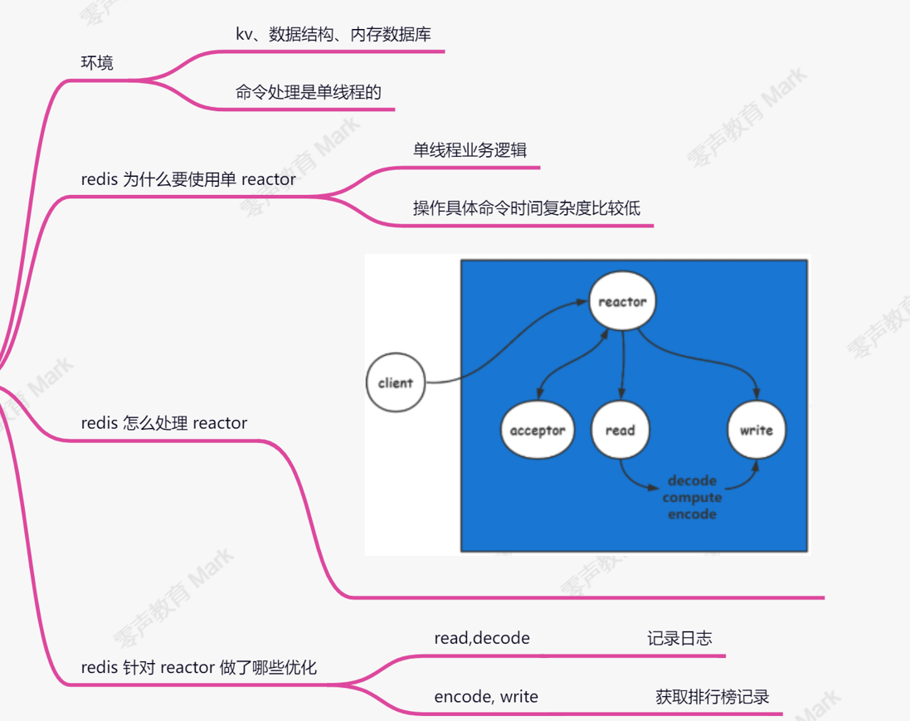

### redis是什么

1.远程字典服务，也是一个通过TCP建立连接的结点，是一个请求回应模型

2.内存数据库：数据一定在内存中，可能在磁盘中

3.KV数据库：	 （1）存储方式：key-value

​							（2）操作方式:通过key操作value

4.数据结构数据库：value:(1)string  (2)list (3)hash (4)zset (5)set (6)stream (7)hyperloglog...

### 怎么设计KV？

- 怎么设计key(string类型)

  1.单个功能一个key：取有意义的key

  2.相同功能多个key：以:作为分割（redis通过:将key划分成树状结构）

### redis命令处理是单线程的，因为redis提供了丰富的数据结构，多线程加锁太复杂

### redis网络reactor组件

redis将此模型进行优化，将read、decode过程，encode、write过程进行多线程处理

