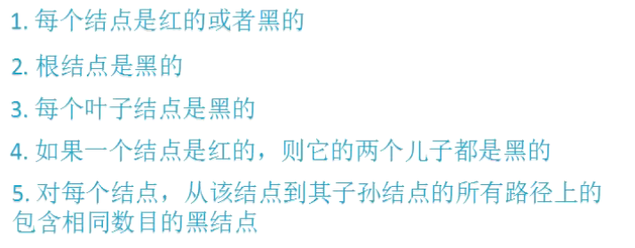

## 红黑树（二叉查找树）

强查找：1.rbtree

​				2.hash

​				3.b/b+tree

​				4.跳表 

##### 性质

定义红黑树一般把unsigned char  color定义在最后以实现内存对齐

插入结点为红色  

[二叉树与红黑树.pdf](file:///D:/零声Linux/数据结构/二叉树与红黑树.pdf)

#### 红黑树中序遍历具有有序性

