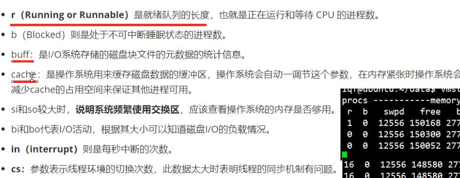

[Linux系统运行时参数命令、网络、磁盘参数和日志监控.pdf](file:///D:/零声Linux/Linux/Linux运行时参数/Linux系统运行时参数命令、网络、磁盘参数和日志监控.pdf)

**CPU使用监测**

系统自带：ps /top

第三方安装: mpstat/pidstat

安装对应命令:apt install stress sysstat

pidstat 	-p

pidstat和mpstat的区别在于pidstat能指定进程的进程号

**pidstat**主要显示进程对资源的占用

**mpstat**主要显示计算机资源的占用情况

**vmstat:**

#### 安装压力测试工具（sysbench）

数据库压力测试可能会用到

---

iostat 监控CPU占用率、平均负载值及I/O读写速度

#### netstat 查看网络情况

### 好用的Linux监测工具-------glances

#### lsof -i:80 查看80端口的进程

### strace 可执行文件 + 端口//查看经过的系统调用

### cadvisor(监视容器)

[9. 容器监控.pdf](file:///D:/零声Linux/docker/docker数据卷、网络、监控/9. 容器监控.pdf)

### node exploer

[9. 容器监控.pdf](file:///D:/零声Linux/docker/docker数据卷、网络、监控/9. 容器监控.pdf)

### prometheus

[9. 容器监控.pdf](file:///D:/零声Linux/docker/docker数据卷、网络、监控/9. 容器监控.pdf)

需要编写配置文件(.yml)

官方文档：

https://prometheus.io/docs/prometheus/latest/configuration

prometheus下的configuration