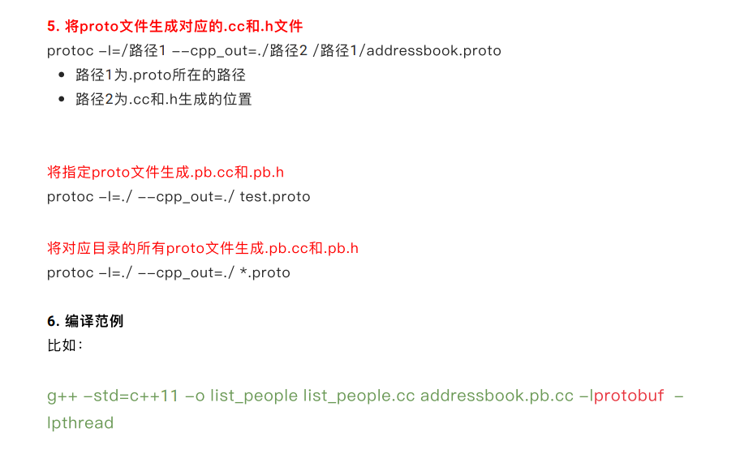

## 自定义协议

需要解决的问题：

1.tcp的分包和粘包

​	(1)加分隔符

​		通过while循环一个一个遍历buffer找到分隔符

​	(2)在应用层协议头加上包的长度

​		发送大包时，同样通过while接收，将每一个小包合成大包

2.json/xml,或者自定义格式

xml本地用的多，，如：本地UI，本地游戏信息

json最通用，如：http api(注册账号)

protobuffer最轻量最高效，如：rpc、游戏、即时通讯

[参考-Redis协议规范-20221011.pdf](file:///D:/零声Linux/网络/Protobuffer/参考-Redis协议规范-20221011.pdf)

[参考-云平台节点服务器设计说明书_v0.4.10.pdf](file:///D:/零声Linux/网络/Protobuffer/参考-云平台节点服务器设计说明书_v0.4.10.pdf)

[应用层协议设计ProtoBuf-20221011v1.1.pdf](file:///D:/零声Linux/网络/Protobuffer/应用层协议设计ProtoBuf-20221011v1.1.pdf)

jsoncpp可以在客户端去用，不建议在服务器去用，因为解析效率低

rapidjson可在服务器去用

## protocolbuffer下载

wget https://github.com/protocolbuffers/protobuf/releases/download/v21.7/protobuf-cpp-3.21.7.zip

安装unzip解压，之后按照第四个pdf进行安装即可

## protobuf安装

1.解压

tar -zxvf protobuf-cpp-3.8.0.tar.gz

2.编译

./configure

make

**sudo make install**

**sudo ldconfig**

3.显示版本信息

protoc -v 

## protobuf语法(一般使用lite动态库)

[参考-Protobuf3语法详解-20221011.pdf](file:///D:/零声Linux/网络/Protobuffer/参考-Protobuf3语法详解-20221011.pdf)

```
option optimize_for = LITE_RUNTIME;
proto文件写这一行才能用lite库
```

关键字：

repeated	 		可重复的字段，保留所有值，可视为数组

service 				服务关键字，其中放有rpc服务

rpc						rpc的接口 (rpc   Hello(参数类)  returns (返回类)  )

message			  message类，定义一个c++类

map<key,value> map映射

### Protobuf（C++）

#### 1.简单（非嵌套）消息内容的赋值

简单的消息内容直接用set_来赋值就行。

赋值方式：

```c++
vehicle_heartbeat.set_vehicle_speed(1.2);
```

#### 2.嵌套消息内容的赋值

自己定义的复杂嵌套消息不能够通过简单的set_来赋值，可采取set_allocated和mutable_两种方式，但是二者的赋值方式是不同的。

使用set_allocated_，赋值的对象需要new出来，不能用局部的，因为这里用的的是对象的指针。当局部的对象被销毁后，就会报错。

##### 错误的赋值方式：

```c++
PointLLHA point;
point.set_longitude(116.20);
point.set_latitude(39.56);
vehicle_heartbeat.set_allocated_vehicle_pose(&point);// 这里传入的是一个马上会被销毁的指针
```

使用mutable_，赋值时候，可以使用局部变量，因为在调用的时，内部做了new操作。

##### 正确的赋值方式：

赋值方式1（使用set_allocated_）：

```
PointLLHA *point = new PointLLHA;
point->set_longitude(116.20);
point->set_latitude(39.56);
vehicle_heartbeat.set_allocated_vehicle_pose(point);// 这里传入的是一个指针
```


赋值方式2（使用mutable_）：

```c++
PointLLHA point;
point.set_longitude(116.20);
point.set_latitude(39.56);
vehicle_heartbeat.mutable_vehicle_pose()->CopyFrom(point);// 这里传入的是一个变量，mutable内部有一个new函数
```

3.重复消息内容的赋值
带有repeated字段的消息，通过add_依次赋值。

赋值方式：

```c++
// 第一个点
PointLLHA *way_point = vehicle_routing_info.add_way_points();
way_point->set_longitude(116.20);
way_point->set_latitude(39.56);
// 第二个点
PointLLHA *way_point = vehicle_routing_info.add_way_points();
way_point->set_longitude(116.21);
way_point->set_latitude(39.57);
```


## Protobuffer编译



