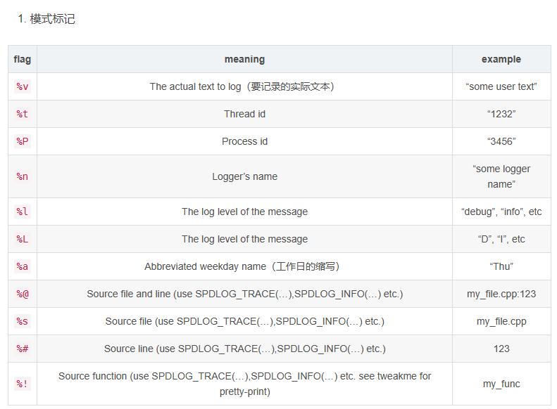
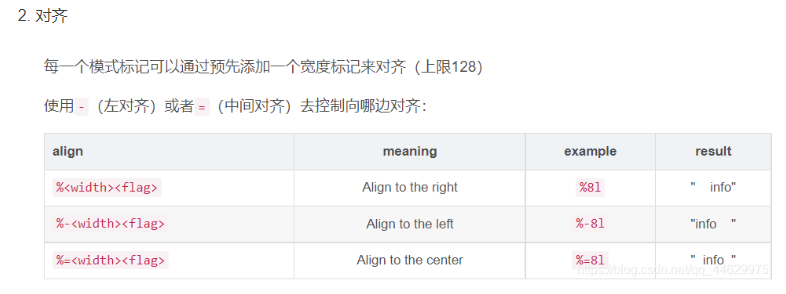

```markdown
（1）线程安全：spdlog:: 命名空间下的是线程安全的；类似于：spdlog::set_error_handler(log_err_handler); // or logger->set_error_handler(log_err_handler);
（2）对于sinks，以 _mt 后缀结尾的是线程安全的，比如：daily_file_sink_mt，以_st 后缀结尾的是非线程安全的，比如：daily_file_sink_st
（3）有关异步设置logger 
<https://blog.csdn.net/haojie_superstar/article/details/89383433?utm_medium=distribute.pc_relevant.none-task-blog-2~default~BlogCommendFromMachineLearnPai2~default-2.control&depth_1-utm_source=distribute.pc_relevant.none-task-blog-2~default~BlogCommendFromMachineLearnPai2~default-2.control>
（4）使用spdlog::get("...")访问loggers缺点：loggers可以在任何地方使用线程安全的spdlog::get("logger_name")来进行访问，返回智能指针；注意：spdlog::get可能会拖慢你的程序，因为它内部维护了一把锁，所以要谨慎使用。比较推荐的用法是保存返回的shared_ptr<spdlog::logger>，直接使用它，至少在频繁访问的代码中。
```

### level

```
enum level_enum //等级表
{
trace = SPDLOG_LEVEL_TRACE, // 最低
debug = SPDLOG_LEVEL_DEBUG,
info = SPDLOG_LEVEL_INFO,
warn = SPDLOG_LEVEL_WARN,
err = SPDLOG_LEVEL_ERROR,
critical = SPDLOG_LEVEL_CRITICAL, // 最高
off = SPDLOG_LEVEL_OFF,
n_levels
};
```

### basic use

```c++
#include <iostream>
#include <memory>
#include "spdlog/spdlog.h"
#include "spdlog/sinks/rotating_file_sink.h"
#include "spdlog/sinks/daily_file_sink.h"
#include "spdlog/sinks/stdout_color_sinks.h"
int main01(int argc, char* argv[]) 
{
	/*创建一个控制台对象*/
	auto console = spdlog::stdout_color_mt("ybhy");
	/*在控制台输出以下数据 -- 不同的等级有不同的颜色对应 ：info、error、warn、critical*/
	console->info("信息");
	console->warn("警告");
	console->error("错误");
	console->critical("危险");
	/*上面的另一种写法*/
	spdlog::info("信息");
	spdlog::warn("警告");
	spdlog::error("错误");
	spdlog::critical("危险");

	/*根据对象输出到控制台 -- 类似于指定用户那种*/
	console->info("Welcome to spdlog!");
	console->info("Support for floats {:03.2f}", 1.23456);
	console->info("Positional args are {1} {0}..", "too", "supported");
	console->info("{:<30}", "left aligned");
	console->warn("Easy padding in numbers like {:08d}", 12);
	console->error("Some error message with arg{}..", 1);
	console->critical("Support for int: {0:d};  hex: {0:x};  oct: {0:o}; bin: {0:b}", 42);
	/*通过 get() 方法获取 相关对象指针 -- 输入相关数据*/
	spdlog::get("ybhy")->info("loggers can be retrieved from a global registry using the spdlog::get(logger_name) function");
	/*显示格式*/
	spdlog::set_pattern("[%Y-%m-%d %H:%M:%S] [%l] [%n],%v");
	/*关闭所有logger对象*/
	spdlog::drop_all();
	return 0；
}
```

### Format



