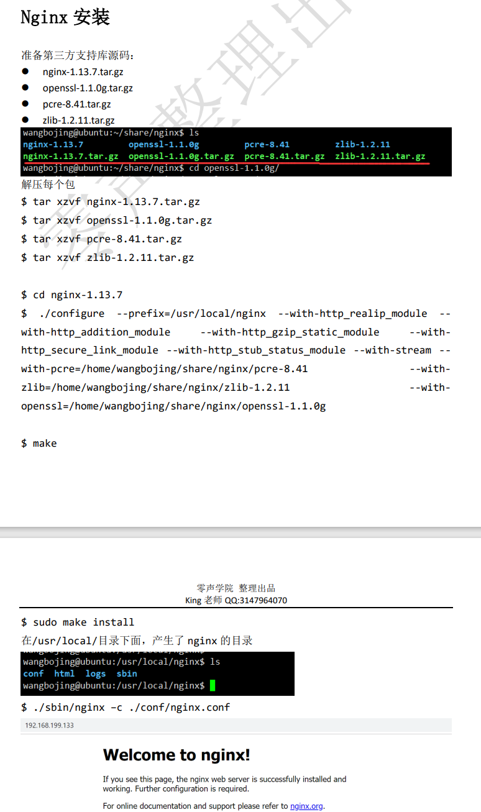
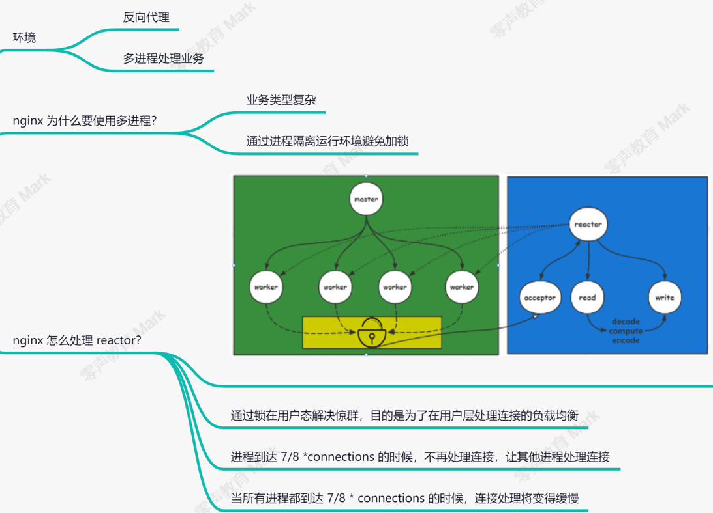

### Nginx安装

[Nginx反向代理与系统参数配置conf原理 (2).pdf](file:///D:/零声Linux/nginx/Nginx反向代理与系统参数配置conf原理 (2).pdf)

安装shell

```shell
 auto/configure --prefix=/usr/local/nginx --with-http_realip_module --with-http_addition_module --with-http_gzip_static_module --with-http_secure_link_module --with-http_stub_status_module --with-stream --with-pcre=/home/gong/src/nginx/pcre-8.41 --with-zlib=/home/gong/src/nginx/zlib-1.2.11 --with-openssl=/home/gong/src/nginx/openssl-OpenSSL_1_1_0g
```



### Nginx网络组件



# 配置文件

文件夹

```
location = / {
 # 精确匹配 / ，主机名后面不能带任何字符串
 [ configuration A ]
}
 
location / {
 # 因为所有的地址都以 / 开头，所以这条规则将匹配到所有请求
 # 但是正则和最长字符串会优先匹配
 [ configuration B ]
}
 
location /documents/ {
 # 匹配任何以 /documents/ 开头的地址，匹配符合以后，还要继续往下搜索
 # 只有后面的正则表达式没有匹配到时，这一条才会采用这一条
 [ configuration C ]
}
 
location ~ /documents/Abc {
 # 匹配任何以 /documents/Abc 开头的地址，匹配符合以后，还要继续往下搜索
 # 只有后面的正则表达式没有匹配到时，这一条才会采用这一条
 [ configuration C ]
}
 
location ^~ /images/ {
 # 匹配任何以 /images/ 开头的地址，匹配符合以后，停止往下搜索正则，采用这一条。
 [ configuration D ]
}
 
location ~* \.(gif|jpg|jpeg)$ {
 # 匹配所有以 gif,jpg或jpeg 结尾的请求
 # 然而，所有请求 /images/ 下的图片会被 config D 处理，因为 ^~ 到达不了这一条正则
 [ configuration E ]
}
 
location /images/ {
 # 字符匹配到 /images/，继续往下，会发现 ^~ 存在
 [ configuration F ]
}
 
location /images/abc {
 # 最长字符匹配到 /images/abc，继续往下，会发现 ^~ 存在
 # F与G的放置顺序是没有关系的
 [ configuration G ]
}
 
location ~ /images/abc/ {
 # 只有去掉 config D 才有效：先最长匹配 config G 开头的地址，继续往下搜索，匹配到这一条正则，采用
  [ configuration H ]
}
 
location ~* /js/.*/\.js {
  [ configuration I ]
}

```

代理一台服务器：

```nginx
worker_processes 2;//worker进程最大数，一般和核心数一样
events{
	 worker_connection 1024;//客户端连接数
}
http{
	server{
		listen 8888;//server监听在8888
		location / {
			proxy_pass http://192.168.130.128:9999;//server的一个端口只能代理一台另外服务器的端口
		}
	}
	server{
		listen 8889;
	}
}
```

代理多台服务器：

```nginx
worker_processes 2;//worker进程最大数，一般和核心数一样
events{
	 worker_connection 1024;//客户端连接数
}
http{
	upstream backend{
		server 192.168.199.128:9000 weight=2;//权重实现负载均衡
		server 192.168.199.129 weight=1;
	}
	server{
		listen 8888;//server监听在8888
		location / {
			proxy_pass http://backend;//8888端口代理多台服务器（具有相同的功能）,轮询遍历backend
		}
	}
	server{
		listen 8889;
	}
}
```

将配置文件分在不同文件写

```nginx
worker_processes 2;//worker进程最大数，一般和核心数一样
events{
	 worker_connection 1024;//客户端连接数
}
http{
	upstream backend{
		server 192.168.199.128:9000 weight=2;//权重实现负载均衡
		server 192.168.199.129 weight=1;
	}
	include */*.conf
}
```

```
index后面可以跟多个设置，如果访问的时候没有指定具体访问的资源，则会依次进行查找，找到第一个为止。
location / {
	root /usr/local/nginx/html;
	index index.html index.htm;
}
访问该location的时候，可以通过 http://ip:port/，地址后面如果不添加任何内容，
则默认依次访问index.html和index.htm，找到第一个来进行返回
```

# Nginx过滤器模块的设计

upstream模块：用于前端通过自定义协议请求后端等场景

filter模块：用于后端返回给前端的数据进行md5加密等场景

handler模块：用于接收前端的消息并处理掉一部分等场景

# 模块编写

### 头文件

```c++
#include "ngx_config.h"
#include "ngx_conf_file.h"
#include "nginx.h"
#include "ngx_core.h"
#include "ngx_string.h"
#uinclude "ngx_palooc.h"//内存池
#include "ngx_array.h"
#include "ngx_hash.h"
```

### 代码

```c++
#include <stdio.h>
#include "ngx_config.h"
#include "ngx_conf_file.h"
#include "nginx.h"
#include "ngx_core.h"
#include "ngx_string.h"
#include "ngx_palloc.h"
#include "ngx_array.h"
#include "ngx_hash.h"
volatile ngx_cycle_t  * ngx_cycle;
#define unused(x)	(x)=(x)
void
ngx_log_error_core(ngx_uint_t level, ngx_log_t *log, ngx_err_t err,const char *fmt, ...) {
	unused(level);
	unused(log);
	unused(err);
	unused(fmt);
}
typedef struct  {
	int name;
	int github;
} ngx_teacher_t;
void print_pool(ngx_pool_t *pool) {
	while (pool) {
		printf("avail pool memory size: %ld\n\n\n", 
				pool->d.end - pool->d.last);
		pool = pool->d.next;
	}
}
// string
// list
// queue
// array
// hash
// palloc
int main() {
#if 0
	ngx_str_t name = ngx_string("king");
	printf("name len: %ld\n", name.len);
	printf("name data: %s\n", name.data);
#elif 0
	ngx_pool_t *pool;
	pool = ngx_create_pool(1024, NULL);
	print_pool(pool);
	ngx_array_t *arr = ngx_array_create(pool, 32, sizeof(ngx_teacher_t));
	print_pool(pool);
	ngx_teacher_t *t1 = ngx_array_push(arr);
	t1->name = 13;
	t1->github = 15;
	//t1->name = ngx_string("king"); //
	//t1->github = ngx_string("github.com/wangbojing");
	print_pool(pool);
	ngx_teacher_t *t2 = ngx_array_push(arr);
	t2->name = 20;
	t2->github = 25;
	//t2->name = ngx_string("xxxx");
	//t2->github = ngx_string("github.com/xxxx");
	print_pool(pool);
#else
	ngx_pool_t *pool;
	pool = ngx_create_pool(1024, NULL);
	print_pool(pool);
	ngx_list_t *list = ngx_list_create(pool, 32, sizeof(ngx_teacher_t));
	print_pool(pool);
	ngx_teacher_t *t1 = ngx_list_push(list);
	t1->name = 13;
	t1->github = 15;
	print_pool(pool);
	ngx_teacher_t *t2 = ngx_list_push(list);
	t2->name = 20;
	t2->github = 25;
	print_pool(pool);
#endif
}
```

# Nginx中的结构体

## ngx_module_t

要读懂nginx源码，并理解其原理，首当其冲的是理解ngx_module_t结构体。因为nginx的主框架只有少量核心源代码，大量强大功能都是在各个模块中实现的。众多模块共分为五个大类：核心模块、HTTP模块、Event模块、Mail模块、配置模块。

而所有这些模块都遵循一个统一的接口设计规范：ngx_module_t。

```text
typedef struct ngx_module_s          ngx_module_t;
```

所以ngx_module_t就是ngx_module_s结构体（定义在：src/core/ngx_module.h中），下面我们看一下这个结构体，笔者为其加上了中文注释：

```c++
struct ngx_module_s {
    ngx_uint_t            ctx_index;    //是该模块在同一类模块中的序号，用NGX_MODULE_V1初始化为NGX_MODULE_UNSET_INDEX（-1）
    
    ngx_uint_t            index;    //该模块在所有Nginx模块中的序号， 即在ngx_modules数组里的唯一索引，用NGX_MODULE_V1初始化为NGX_MODULE_UNSET_INDEX（-1）
    
    char                 *name; // 模块的名字，用NGX_MODULE_V1初始化为NULL
    ngx_uint_t            spare0; //保留字段，用NGX_MODULE_V1初始化为0
    ngx_uint_t            spare1; //保留字段，用NGX_MODULE_V1初始化为0
    
    ngx_uint_t            version; // 版本号：在nginx.h中：#define NGINX_VERSION      "1.21.3"
    
    const char           *signature; // 模块的二进制兼容性签名，即NGX_MODULE_SIGNATURE
     /* src/core/ngx_module.h中有一个宏，用来初始化上面这些字段：
    #define NGX_MODULE_V1                                                         \
        NGX_MODULE_UNSET_INDEX, NGX_MODULE_UNSET_INDEX,                           \
        NULL, 0, 0, nginx_version, NGX_MODULE_SIGNATURE
    */
    
    void                 *ctx;
    /*
    ctx为ngx_module_s与各个模块的纽带，也可以说是具体模块的公共接口。
    下文中我们会以核心模块为例说明下这个字段
    */

    ngx_command_t        *commands;   // 模块支持的指令，数组形式，最后用空对象表示结束
    
    ngx_uint_t            type; 
    /* 模块的类型标识，可选值如下
     #define NGX_CORE_MODULE      0x45524F43  /* 核心模块 */
     #define NGX_CONF_MODULE      0x464E4F43  /* 配置模块 */
     #define NGX_EVENT_MODULE     0x544E5645  /* event模块 */
     #define NGX_HTTP_MODULE      0x50545448  /* http模块 */
     #define NGX_MAIL_MODULE      0x4C49414D  /* mail模块 */
    */    

   // 以下7个函数指针，俗称钩子函数，会在程序启动、结束等不同阶段被调用
    ngx_int_t           (*init_master)(ngx_log_t *log);//主进程初始化时调用
    ngx_int_t           (*init_module)(ngx_cycle_t *cycle);//模块初始化时调用（在ngx_init_cycle里被调用）
    ngx_int_t           (*init_process)(ngx_cycle_t *cycle);//工作进程初始化时调用
    ngx_int_t           (*init_thread)(ngx_cycle_t *cycle);//线程初始化时调用
    void                (*exit_thread)(ngx_cycle_t *cycle);//线程退出时调用
    void                (*exit_process)(ngx_cycle_t *cycle);//工作进程退出时调用（在ngx_worker_process_exit调用）
    void                (*exit_master)(ngx_cycle_t *cycle);//主进程退出时调用（在ngx_master_process_exit调用）
    
    // 下面八个预留字段，用NGX_MODULE_V1_PADDING宏全部初始化为0
    //#define NGX_MODULE_V1_PADDING  0, 0, 0, 0, 0, 0, 0, 0
    uintptr_t             spare_hook0;
    uintptr_t             spare_hook1;
    uintptr_t             spare_hook2;
    uintptr_t             spare_hook3;
    uintptr_t             spare_hook4;
    uintptr_t             spare_hook5;
    uintptr_t             spare_hook6;
    uintptr_t             spare_hook7;
};
```

我们看下ctx对应的字段，在核心模块中是 &ngx_core_module_ctx，他其实是一个ngx_core_module_t结构体，这个结构体的定义在src/core/ngx_module.h中：

```c++
    typedef struct {
        ngx_str_t             name;
        //下面是两个函数指针，核心模块必须实现这两个方法
        void               *(*create_conf)(ngx_cycle_t *cycle);
        char               *(*init_conf)(ngx_cycle_t *cycle, void *conf);
    } ngx_core_module_t;
```

在src\core\nginx.c中实现了这个结构体：

```c++
          static ngx_core_module_t  ngx_core_module_ctx = {
               ngx_string("core"), //name字段
               ngx_core_module_create_conf,//实现该接口的第一个方法
               ngx_core_module_init_conf//实现该接口的第二个方法
           };
```

每一个模块都有自己的公共接口结构体，ngx_core_module_t是核心模块的，其他模块我们后面的文章中会介绍到。

上面的ngx_core_module_create_conf方法作用是初始化ngx_core_conf_t结构(存放core_module支持的指令)，保存在ngx_cycle->conf_ctx数组中，这些都是与nginx配置文件有关的

## ngx_command_t

分别是ngx_core_module_create_conf和ngx_core_module_init_conf，前者用于解析配置文件，后者用于初始化。

那本文就以此为例引领大家了解一下nginx中关于配置文件解析的源码。用过nginx的读者都非常熟悉其配置文件的指令配置，最典型的配置文件就是nginx.conf。

首先呢，我们先看一个相关的结构体：ngx_command_t

### ngx_command_t结构体介绍

```c++
typedef struct ngx_command_s         ngx_command_t;
```

也就是ngx_command*s结构体，定义在src/core/ngx_conf_file.h中*

```c++
struct ngx_command_s {
    ngx_str_t             name; //配置指令名称
    ngx_uint_t            type; //配置指令类型
    char               *(*set)(ngx_conf_t *cf, ngx_command_t *cmd, void *conf);//该配置对应的处理函数
    //下面两个偏移量用于定位该配置的存储地址
    ngx_uint_t            conf;
    ngx_uint_t            offset;
    void                 *post;//可以指向任意结构，我们在后面的实例中详述
};
```

我们重点讲解 一下type字段，这个指令类型共分四类：配置位置、参数数目、区分指令与配置块、其他。下面我们分别介绍下：

1、配置位置：表示指令可配置位置，例如：NGX_MAIN_CONF表示指令只能在配置文件进行配置，不能在任何配置块中配置。NGX_ANY_CONF表示哪里都行。

此外对于我们编写的大多数模块而言，都是在处理http相关的事情，也就是所谓的都是NGX_HTTP*MODULE，对于这样类型的模块，其配置可能出现的位置也是分为直接出现在http里面，以及其他位置。在src/http/ngx_http_config.h中有下面几个宏：*

```c++
#define NGX_HTTP_MAIN_CONF        0x02000000        //可以直接出现在http配置指令里
#define NGX_HTTP_SRV_CONF         0x04000000         //可以出现在http里面的server配置指令里
#define NGX_HTTP_LOC_CONF         0x08000000         //可以出现在http server块里面的location配置指令里
#define NGX_HTTP_UPS_CONF         0x10000000          //可以出现在http里面的upstream配置指令里
#define NGX_HTTP_SIF_CONF         0x20000000           //可以出现在http里面的server配置指令里的if语句所在的block中
#define NGX_HTTP_LIF_CONF         0x40000000           //可以出现在http server块里面的location配置指令里的if语句所在的block中
#define NGX_HTTP_LMT_CONF         0x80000000         //可以出现在http里面的limit_except指令的block中
```

2、参数数目：在src/core/ngx_conf_file.h中有如下一些宏：

```c++
#define NGX_CONF_NOARGS      0x00000001   //表示该指令没有参数
#define NGX_CONF_TAKE1       0x00000002     //有一个参数
#define NGX_CONF_TAKE2       0x00000004
... ...
#define NGX_CONF_TAKE7       0x00000080    //7个参数
#define NGX_CONF_MAX_ARGS    8                 // 参数的最大个数也就是八个
#define NGX_CONF_ANY         0x00000400      //参数数目任意
#define NGX_CONF_1MORE       0x00000800    //至少1个参数
#define NGX_CONF_2MORE       0x00001000    //至少两个
```

type参数都是位标记，可以进行或运算，例如同时支持1个或2个参数，可以这样写：

NGX_CONF_TAKE1|NGX_CONF_TAKE2

而src/core/ngx_conf_file.h也组合好了一些常用的组合

```c++
#define NGX_CONF_TAKE12      (NGX_CONF_TAKE1|NGX_CONF_TAKE2)
#define NGX_CONF_TAKE13      (NGX_CONF_TAKE1|NGX_CONF_TAKE3)

#define NGX_CONF_TAKE23      (NGX_CONF_TAKE2|NGX_CONF_TAKE3)

#define NGX_CONF_TAKE123     (NGX_CONF_TAKE1|NGX_CONF_TAKE2|NGX_CONF_TAKE3)
#define NGX_CONF_TAKE1234    (NGX_CONF_TAKE1|NGX_CONF_TAKE2|NGX_CONF_TAKE3   \
                              |NGX_CONF_TAKE4)
```

3、区分单条指令和块指令：在src/core/ngx_conf_file.h中有如下宏：

```c++
#define NGX_CONF_BLOCK       0x00000100   //该指令作为一个块指令
```

4、其他指令如：在src/core/ngx_conf_file.h中有如下宏：

```c++
#define NGX_CONF_FLAG        0x00000200    //该指令作为一个标识类指令，只能配置on或off
#define NGX_DIRECT_CONF      0x00010000   //该指令的存储地址可直接获取，不需要再额外分配
```

### ngx_cycle_t

我们在nginx.c中找到main函数，这个就是nginx的主函数，里面有如下代码：

```text
ngx_cycle_t      *cycle, init_cycle;
... ...
cycle = ngx_init_cycle(&init_cycle);  //这是解析配置文件的入口函数
```

我们看下ngx_init_*cycle函数的部分源代码，在src/core/ngx_cycle.c中：*

```c++
    ... ...

    ngx_memzero(&conf, sizeof(ngx_conf_t));
    /* STUB: init array ? */
    conf.args = ngx_array_create(pool, 10, sizeof(ngx_str_t));
    if (conf.args == NULL) {
        ngx_destroy_pool(pool);
        return NULL;
    }

    conf.temp_pool = ngx_create_pool(NGX_CYCLE_POOL_SIZE, log);
    if (conf.temp_pool == NULL) {
        ngx_destroy_pool(pool);
        return NULL;
    }


    conf.ctx = cycle->conf_ctx;
    conf.cycle = cycle;
    conf.pool = pool;
    conf.log = log;
    conf.module_type = NGX_CORE_MODULE;
    conf.cmd_type = NGX_MAIN_CONF;

... ...

    if (ngx_conf_parse(&conf, &cycle->conf_file) != NGX_CONF_OK) {
        environ = senv;
        ngx_destroy_cycle_pools(&conf);
        return NULL;
    }
```

### ngx_conf_t

也就是说main调用ngx_init_*cycle，*ngx_init_*cycle生成*ngx_conf_t结构体后传给ngx_conf_parse函数：

```c++
char *ngx_conf_parse(ngx_conf_t *cf, ngx_str_t *filename);
```

先看一下第一个参数的类型结构体，在src/core/ngx_*conf_file.h*

```c++
typedef struct ngx_conf_s            ngx_conf_t;

struct ngx_conf_s {
    char                 *name;             //当前读取到的配置名称
    ngx_array_t          *args;           //当前读取到的配置参数，是一个数组

    ngx_cycle_t          *cycle;          //系统参数，ngx_cycle_s结构体，后面我们会详细描述
    ngx_pool_t           *pool;           //所使用的内存池
    ngx_pool_t           *temp_pool;  //用于解析配置文件的临时内存池，解析完成后释放
    ngx_conf_file_t      *conf_file;    //存放Nginx配置文件的相关信息，也是一个结构体
    ngx_log_t            *log;             //描述日志文件的相关属性

    void                 *ctx;                //描述指令的上下文
    ngx_uint_t            module_type;   //模块类型：core、http、events等
    ngx_uint_t            cmd_type;       //指令类型

    ngx_conf_handler_pt   handler;    //指令自定义的处理函数
    void                 *handler_conf;   //自定义处理函数需要的相关配置
};
```

ngx_conf_parse函数的逻辑比较简单，就是把配置文件信息读取出来再去调用ngx_conf_handler函数，我们重点讲解下ngx_conf_handler函数。

```c++
static ngx_int_t
ngx_conf_handler(ngx_conf_t *cf, ngx_int_t last)
{
    char           *rv;
    void           *conf, **confp;
    ngx_uint_t      i, found;
    ngx_str_t      *name;
    ngx_command_t  *cmd;

    name = cf->args->elts;//args的第一个字段是名字信息

    found = 0;//是否找到

    for (i = 0; cf->cycle->modules[i]; i++) {//遍历所有的模块

        cmd = cf->cycle->modules[i]->commands;//指令数组
        if (cmd == NULL) {
            continue;
        }

        for ( /* void */ ; cmd->name.len; cmd++) {

            if (name->len != cmd->name.len) {
                continue;
            }

            if (ngx_strcmp(name->data, cmd->name.data) != 0) {
                continue;
            }

            found = 1;//找到一个名字符合的

            if (cf->cycle->modules[i]->type != NGX_CONF_MODULE
                && cf->cycle->modules[i]->type != cf->module_type)//校验模块类型，注意NGX_CONF_MODULE
            {
                continue;
            }

            if (!(cmd->type & cf->cmd_type)) { //校验指令类型
                continue;
            }

            if (!(cmd->type & NGX_CONF_BLOCK) && last != NGX_OK) {
                ngx_conf_log_error(NGX_LOG_EMERG, cf, 0,
                                  "directive \"%s\" is not terminated by \";\"",
                                  name->data);
                return NGX_ERROR;
            }

            if ((cmd->type & NGX_CONF_BLOCK) && last != NGX_CONF_BLOCK_START) {
                ngx_conf_log_error(NGX_LOG_EMERG, cf, 0,
                                   "directive \"%s\" has no opening \"{\"",
                                   name->data);
                return NGX_ERROR;
            }

            //校验参数数目
            if (!(cmd->type & NGX_CONF_ANY)) {  

                if (cmd->type & NGX_CONF_FLAG) {

                    if (cf->args->nelts != 2) {
                        goto invalid;
                    }

                } else if (cmd->type & NGX_CONF_1MORE) {

                    if (cf->args->nelts < 2) {
                        goto invalid;
                    }

                } else if (cmd->type & NGX_CONF_2MORE) {

                    if (cf->args->nelts < 3) {
                        goto invalid;
                    }

                } else if (cf->args->nelts > NGX_CONF_MAX_ARGS) {

                    goto invalid;

                } else if (!(cmd->type & argument_number[cf->args->nelts - 1]))
                {
                    goto invalid;
                }
            }

            //conf查找过程
            conf = NULL;
            if (cmd->type & NGX_DIRECT_CONF) {//类型参数包含 NGX_DIRECT_CONF，配置存储区寻址
                //module->index 是代表模块位置的下标 module->ctx_index代表在他所属模块组的下标，参考笔者文章nginx源码学习1
                conf = ((void **) cf->ctx)[cf->cycle->modules[i]->index];//直接取值
            } else if (cmd->type & NGX_MAIN_CONF) {//包含main配置标志位，
                conf = &(((void **) cf->ctx)[cf->cycle->modules[i]->index]);
                /*一般来说core_moudle执行的命令都是进行的块解析，
                他们属于一个功能模块，如果不用的话是不需要进行初始化的，所以都是把指向他配置的指针给他，
                在模块真正调用的时候去设置自己的配置文件信息，然后保存回去就好
                */
            } else if (cf->ctx) {
                confp = *(void **) ((char *) cf->ctx + cmd->conf);

                if (confp) {//有些模块没有配置文件
                    conf = confp[cf->cycle->modules[i]->ctx_index];//通过组下标找到位置
                }
            }
            //完成配置处理
            rv = cmd->set(cf, cmd, conf);

            if (rv == NGX_CONF_OK) {
                return NGX_OK;
            }

            if (rv == NGX_CONF_ERROR) {
                return NGX_ERROR;
            }

            ngx_conf_log_error(NGX_LOG_EMERG, cf, 0,
                               "\"%s\" directive %s", name->data, rv);

            return NGX_ERROR;
        }
    }

    if (found) {
        ngx_conf_log_error(NGX_LOG_EMERG, cf, 0,
                           "\"%s\" directive is not allowed here", name->data);

        return NGX_ERROR;
    }

    ngx_conf_log_error(NGX_LOG_EMERG, cf, 0,
                       "unknown directive \"%s\"", name->data);

    return NGX_ERROR;

invalid:

    ngx_conf_log_error(NGX_LOG_EMERG, cf, 0,
                       "invalid number of arguments in \"%s\" directive",
                       name->data);

    return NGX_ERROR;
}
```

