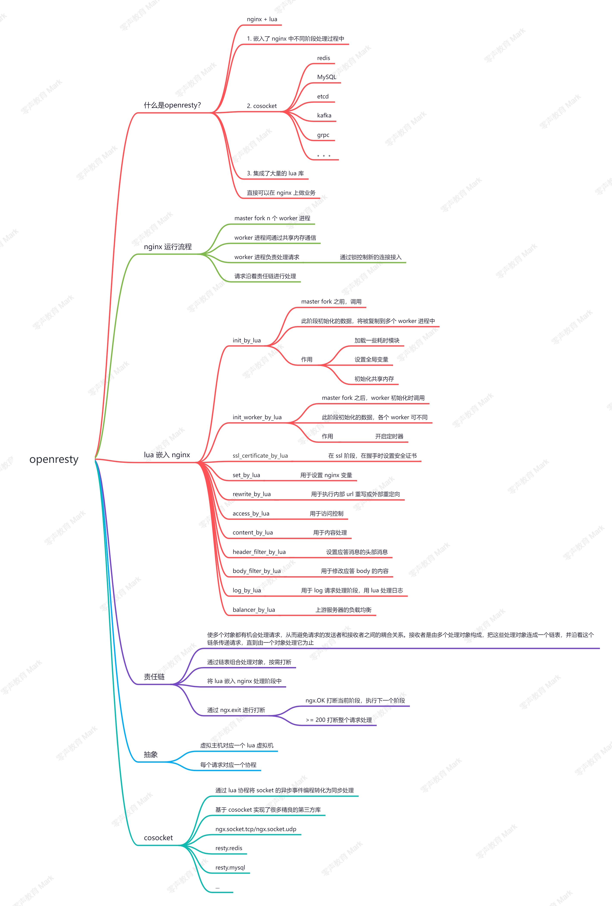

### openresty安装

官网：http://openresty.org/cn/

下载页面：http://openresty.org/cn/download.html

源码包：https://openresty.org/download/openresty-1.21.4.1.tar.gz

```
# 安装依赖
apt-get install libpcre3-dev \ libssl-dev perl make build-essential curl
#安装zlib
apt-get install zlib1g-dev
# 解压源码
tar -xzvf openresty-1.21.4.1.tar.gz
#配置：默认：--prefix=/usr/local/openresty
./configure
make -j2
sudo make install

cd ~
export PATH=/usr/local/openresty/bin:$PATH
```

### 启动、关闭、重启openresty

```
#指定配置启动openresty,要进入openresty的nginx目录
sudo ../bin/openresty -p . -c conf/nginx.conf
#优雅退出
sudo ../bin/openresty -p . -s quit
#重启openresty
sudo ../bin/openresty -p . -s reload
```



### 可以打断nginx责任链的两个函数

```
ngx.redirect
ngx.exit(0)//返回，后续的次责任链不执行
ngx.exit(num)//num>=200,返回，后续主责任链不执行
```

access阶段可以实现黑名单或者token拒绝访问

### restydoc(查询openresty中的函数)

安装：

```
sudo apt-get install openresty-restydoc
```

### 注意

```
没有content_by_lua阶段，nginx会去寻找uri，找不到会直接返回，导致access_by_lua阶段没有效果
```

### openresty转发

#### TCP

```
stream{
    upstream ups{
        server 127.0.0.1:8080;
    }
    server{
        listen 9999;
        proxy_pass ups;
        #由于转发会丢失客户端ip，所以需要用到转发协议，默认v1(ASCII码)形式，还有v2版本（字节流形式）
        #proxy_protocol on;
    }
}
```

proxy_protocol协议内容包括客户端五元组，转发后的第一个数据包就是proxy_protocol协议内容

