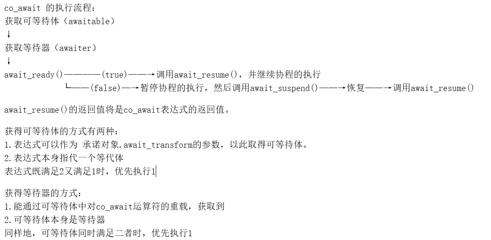
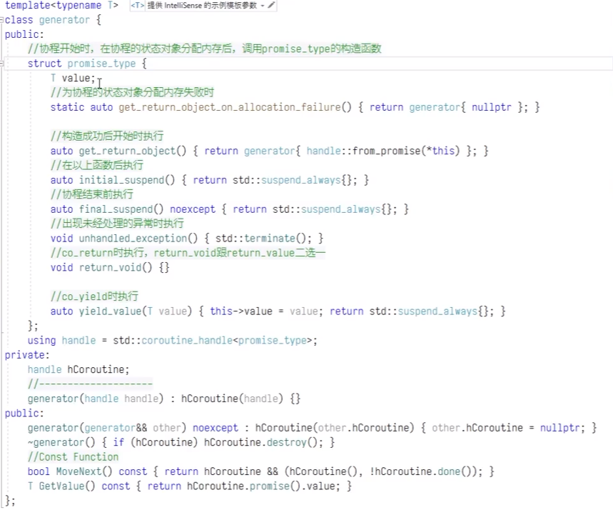

promise_type中必须实现的五个函数

```c++
get_return_object()		//返回协程拥有者
initial_suspend()		//返回suspend_always或者suspend_never		,该函数决定协程被创建的时候是被挂起还是执行
final_suspend()			//同上									,该函数决定协程执行完毕是挂起还是执行，一般都是suspend_always，以便调用 handle.done()获取结束的状态
unhandled_exception()	//出现未经处理的异常时出现
return_void() 或  return_value()	//二者存在一个，co_return时执行
```

选择实现的三个函数

```
static auto get_return_object_on_allaction_failure() //为对象分配内存失败
T await_transform(接收一个表达式)						//返回co_wait的对象（即实现co_await对应方法的类）
yield_value(T value) 								//co_yield时调用，即赋值
```

co_awit必须实现的三个方法

```
bool await_ready()			//返回false表示会暂停，即对含有该方法的类使用 co_await关键字会暂停该类所在的协程
await_suspend()				
await_resume()				
```




