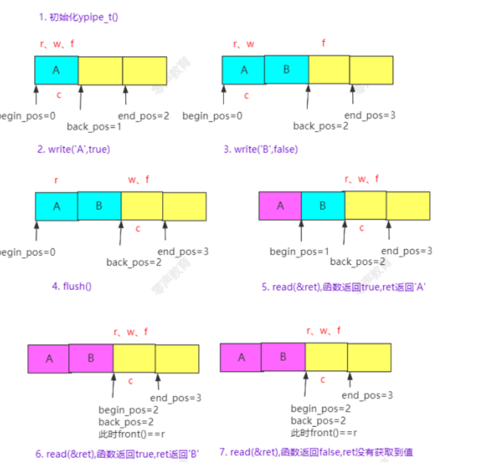

### 锁引起的问题

(1)Cache损坏

(2)在同步机制上的争夺队列

(3)动态内存分配

解决方法：

(1)减少线程的切换

(2)CAS 线程的原子操作

(3)使用数组提前分配好内存(或链表块加数组的方式)

[无锁消息队列实现-课件v1.1.pdf](file:///D:/零声Linux/c++/多线程/无锁消息队列实现-课件v1.1.pdf)

### yqueue_t ypipe_t(只能用于一生产一消费）

write(x,false)之后需要调用flush

