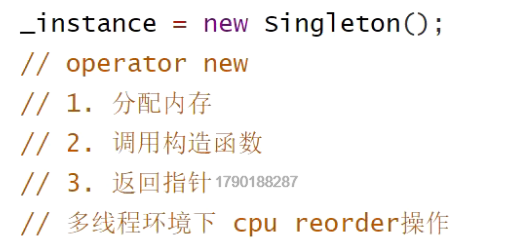

针对cpu产生的指令重排问题

例：

在cpu可能产生132的顺序没有初始化指针指向的数据

#### 使用内存栅栏

atomic_thread_fence(std::memory_order_relaxed)

#### 内存序

```c++
memory_order_relaxed//松散序列，允许cpu随便优化，只保证原子性，可见性//保证原子性

memory_order_acquire//不允许cpu优化函数后面的指令到前面去,既保证原子性、可见性，又保证执行序


memory_order_release//不允许cpu优化函数前的指令到后面去，既保证原子性、可见性，又保证执行序

memory_order_acq_rel//可用在CAS success的时候
```


