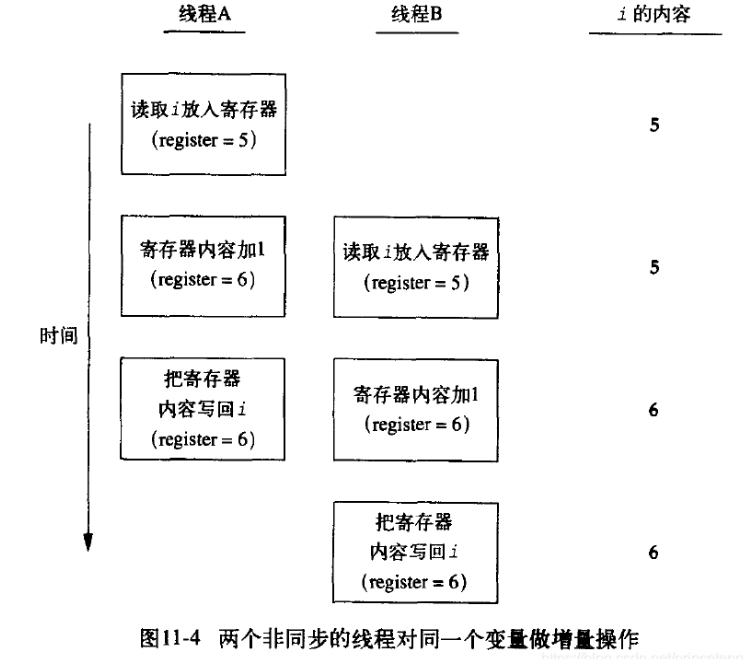

### 多线程

---




1.mutex 互斥锁(对临界资源访问时要互斥访问，否则可能会丢失修改)

void  lock()上锁

void  unlock()开锁


2.lock_guard<T> 在调用构造函数时上锁，析构时开锁

1. `lock_guard(mutex& m)`
2. `lock_guard(mutex& m, adopt_lock)`

```c++
#include<iostream>
#include<thread>
#include<mutex>
#include<atomic>
#if defined(_WIN32)
#include<windows.h>
#define sleep Sleep
#define usleep Sleep
#elif defined(__linux__)
#include<unistd.h>
#endif
#define THREAD_LENGTH 10
using namespace std;
void Count(atomic<int> * count)
{
    for (int i = 0; i < 10000; i++)
    {
        lock_guard<mutex> lm(Mu);
        (*count)++;
        usleep(1);
    }
}
int main()
{
    thread** PList = new thread * [10];
    atomic<int> count(0);
    for (int i = 0; i < THREAD_LENGTH; i++)
    {
        PList[i] = new thread(Count, &count);
    }
    for (int i = 0; i < 100; i++)
    {
        cout << "count :" << count << endl;
        sleep(1);
    }
    return 0;
}
```

3.自旋锁

Pthreads提供了多种锁机制：

- Mutex(互斥量)：pthread_mutex_t
- Spin lock(自旋锁): pthread_spin_t
- Condition Variable(条件变量): pthread_cond_t
- Read/Write lock(读写锁)：pthread_rwlock_t

Pthreads提供的Mutex锁操作相关的API主要有：

- pthread_mutex_lock(pthread_mutex_t *mutex);
- pthread_mutex_trylock(pthread_mutex_t *mutex);
- pthread_mutex_unlock(pthread_mutex_t *mutex);

Pthreads提供的Spin Lock锁操作相关的API主要有：

- pthread_spin_lock(pthread_spinlock_t *lock);
- pthread_spin_trylock(pthread_spinlock_t *lock);
- pthread_spin_unlock(pthread_spinlock_t *lock);

从实现原理上来讲，**Mutex（互斥锁）属于sleep-waiting类型的锁**。例如在一个双核的机器上有两个线程（线程A和线程B）,它们分别运行在Core0和Core1上。假设线程A想要通过pthread_mutex_lock操作去得到一个临界区的锁，而此时这个锁正被线程B所持有，那么线程A就会被阻塞，

Core0会在此时进行上下文切换(Context Switch)将线程A置于等待队列中，此时Core0就可以运行其它的任务而不必进行忙等待。而**Spin lock（自旋锁）**则不然，它属于**busy-waiting类型的锁**，如果线程A是使用pthread_spin_lock操作去请求锁，那么线程A就会一直在Core0上进行忙等待并不停的进行锁请求，直到得到这个锁为止。

**自旋锁（Spin lock）**

自旋锁与互斥锁有点类似，只是自旋锁不会引起调用者睡眠，如果自旋锁已经被别的执行单元保持，调用者就一直循环在那里看是否该自旋锁的保持者已经释放了锁，**“自旋锁”的作用是为了解决某项资源的互斥使用。因为自旋锁不会引起调用者睡眠，所以自旋锁的效率远高于互斥锁。**

自旋锁的不足之处：

**自旋锁一直占用着CPU，他在未获得锁的情况下，一直运行（自旋），所以占用着CPU，如果不能在很短的时间内获得锁，这无疑会使CPU效率降低。**

在用自旋锁时有可能造成死锁，当递归调用时有可能造成死锁，调用有些其他函数也可能造成死锁，如 copy_to_user()、copy_from_user()、kmalloc()等。


***结论***：

自旋锁适用于能够在短时间获得锁的线程（锁间的代码段短），互斥锁适用于长时间获得锁的线程（锁间的代码段长）

4.原子操作

将自增合并为一个原子操作，会用到atomic


```
pthread_setname_np(pthread_self(),"self");//给此线程起名
```


