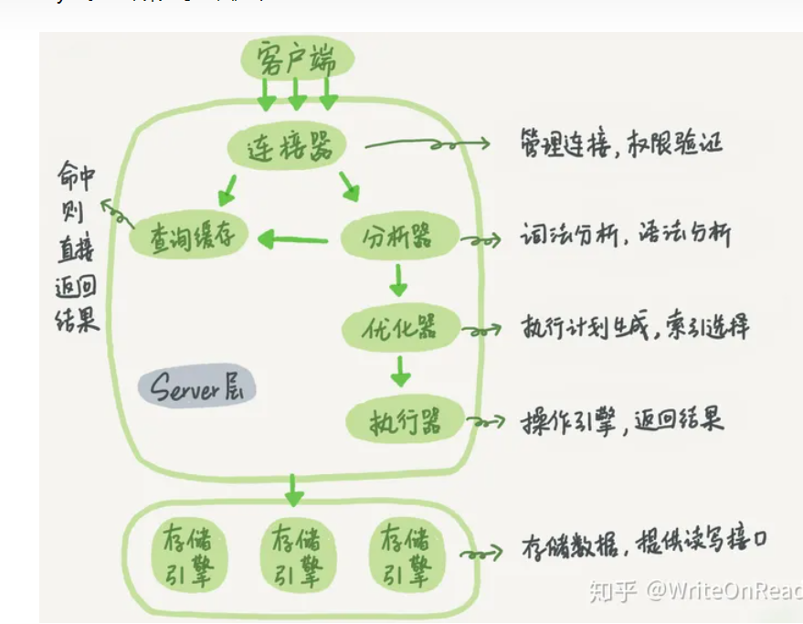

### mysql架构

### 连接原理

采用select多路复用，每接收一个连接就创建一个连接线程，这个线程是阻塞io，因为mysql从设计上就没打算处理过多连接

mysql5.7之前包括5.7有一个查询缓存，8.0之后由于缓存命中率太低，直接删除了

### 怎样执行一条select连接

1.连接器

接收一条连接，检验用户信息(用户名和密码，数据库是否存在)

2.查询缓存（select语句才有）

kv存储，命中直接返回，否则继续执行，8.0之后被删除

3.分析器

语法句法分析生成语法树

4.优化器

制定执行计划，选择查询成本最小的计划

5.执行器

根据执行计划，从存储引擎(先从缓存中查找，再从磁盘中查找)获取数据，并返回客户端

[SQL基本操作-VIP-2304.pdf](file:///D:/零声Linux/mysql/SQL基本操作-VIP-2304.pdf)